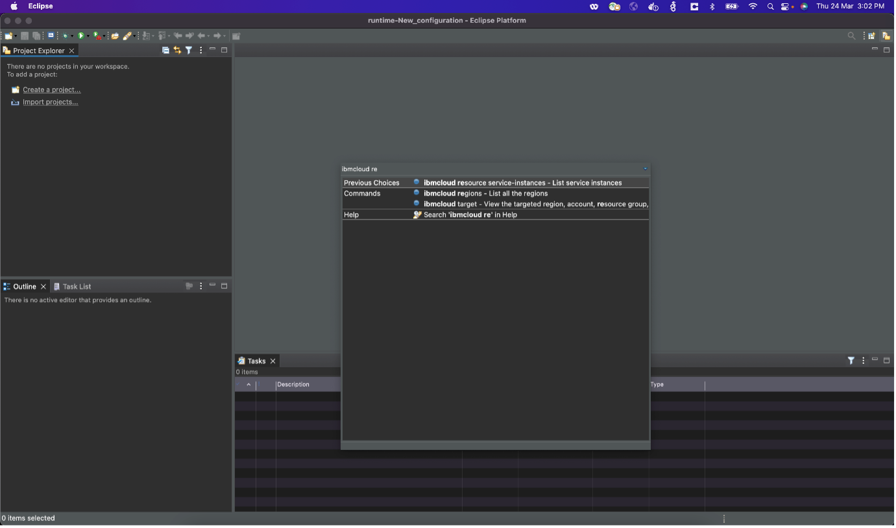

---

copyright:
  years: 2021, 2023
lastupdated: "2023-05-19"

keywords: cli, developer extension, eclipse ide, IBM cloud cli

subcollection: cli

---

{{site.data.keyword.attribute-definition-list}}

# {{site.data.keyword.cloud_notm}} CLI for Eclipse IDE plug-in (preview)
{: #eclipse-ide-plugins}

This preview release of {{site.data.keyword.cloud}} CLI for Eclipse plug-in provides extensions for Eclipse integrated development environments (IDEs). This Eclipse IDE plug-in enables developers to manage their {{site.data.keyword.cloud_notm}} account, resources, and applications within the Eclipse IDE.
{: shortdesc}

This plug-in provides functions that are provided by the [{{site.data.keyword.cloud_notm}} CLI](/docs/cli). The {{site.data.keyword.cloud_notm}} CLI allows developers to work with {{site.data.keyword.cloud_notm}} resources, apps, and containers.

{: caption="Figure 1. IBM Cloud CLI Eclipse plug-in" caption-side="bottom"}

This plug-in supports running `ibmcloud` CLI commands from within the Eclipse environment.

The {{site.data.keyword.cloud_notm}} CLI {{site.data.keyword.dev_cli_short}} `eclipse-ibmcloud-cli` plug-in for Eclipse is an open source project that is available on [GitHub](https://github.com/IBM-Cloud/eclipse-ibmcloud-cli){: external}.
{: note}

## Before you begin
{: #eclipse-ide-prereqs}

To use the Eclipse plug-in, install the following software:

-	[Eclipse](https://www.eclipse.org/downloads/){: external}
-	[{{site.data.keyword.cloud_notm}} CLI](/docs/cli?topic=cli-install-ibmcloud-cli)

If you install the {{site.data.keyword.cloud_notm}} CLI in a custom directory, set the system property `ibmcloud_eclipse_cli_path` to the custom location of the {{site.data.keyword.cloud_notm}} CLI installation. For example, `-Dcom.ibmcloud.eclipse.cli.path=<path-to-ibmcloud-cli-installation>`. Specify this location in the `eclipse.ini` file under `vmargs`.

## Installing the {{site.data.keyword.cloud_notm}} CLI plug-in
{: #eclipse-ide-install}

The {{site.data.keyword.cloud_notm}} CLI plug-in can be installed from the [Eclipse marketplace](https://marketplace.eclipse.org/content/ibm-cloud-dev-tools-eclipse){: external}. Follow the instructions in the marketplace to complete the installation of the plug-in.

## Reporting issues
{: #eclipse-ide-report-issues}

If you want to report bugs or enhancement requests, open a work item in the [GitHub repo](https://github.com/IBM-Cloud/eclipse-ibmcloud-cli/issues).{: external}
