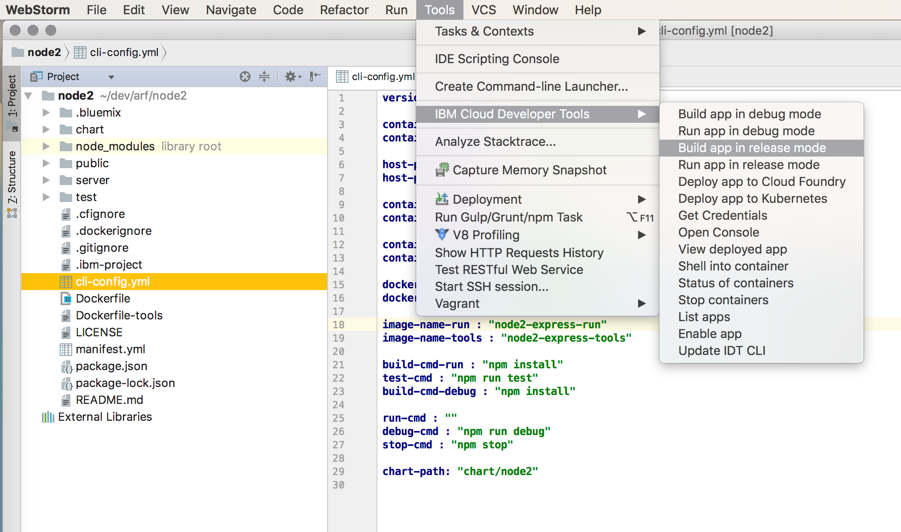

---

copyright:
  years: 2018, 2019
lastupdated: "2019-04-22"

keywords: cli, ibm cloud developer tools, jetbrains, jetbrains ides, intellij, webstorm, android studio, ibmcloud dev, view remote logs, ibmcloud docker commands

subcollection: cloud-cli

---

{:shortdesc: .shortdesc}
{:codeblock: .codeblock}
{:screen: .screen}
{:new_window: target="_blank"}

# IBM Cloud Developer Tools for JetBrains IDEs
{: #ibm-dev-tools-for-jetbrains}

The {{site.data.keyword.cloud}} developer tools extension for JetBrains IDEs, which include `IntelliJ`, `WebStorm`, `Android Studio`, and more, provides new menu entries to directly access {{site.data.keyword.dev_cli_notm}} CLI commands from within the IDE. You can quickly access a subset of `ibmcloud dev` commands for both Docker and Cloud Foundry workflows, including app deployment, starting/stopping/restarting apps on {{site.data.keyword.cloud_notm}}, viewing remote app logs, and more – all without the need to leave the editor’s context.
{:shortdesc}

## Dependencies
{: #jetbrains-dependencies}

To utilize the {{site.data.keyword.cloud_notm}} developer tools extension for JetBrains-based IDEs, you need the [{{site.data.keyword.dev_cli_notm}} CLI](/docs/cli?topic=cloud-cli-ibmcloud-cli#ibmcloud-cli) installed on your system.

## Installation
{: #jetbrains-installation}

The best way to install the {{site.data.keyword.cloud_notm}} developer tools extension for JetBrains IDE, is to go to the [{{site.data.keyword.cloud_notm}} developer tools Github repo's jetbrains](https://github.com/IBM-Cloud/ibm-cloud-developer-tools/tree/master/jetbrains){: new_window}  page, and follow the instructions.

## Usage
{: #jetbrains-usage}

You can either start with an existing server-side app, and Enable it for the {{site.data.keyword.cloud_notm}}, or use the {{site.data.keyword.dev_cli_notm}} CLI to Create a new app from a StarterKit (ibmcloud dev create). When you have your app's project, open it in your JetBrains IDE.

If you have a generic server-side app, select Tools > IBM Cloud Developer Tools > Enable app for {{site.data.keyword.cloud_notm}}. This checks for all the required files and add any that are missing to the app locally and deploy it to {{site.data.keyword.cloud_notm}} by using a Cloud Foundry app, or within a Kubernetes cluster.

Develop your cloud native app by using the basic build, run, and deploy actions from the {{site.data.keyword.cloud_notm}} developer tools menu. If you need to perform actions that aren't in the menu, simply open the Terminal tab and enter the desired commands manually.
