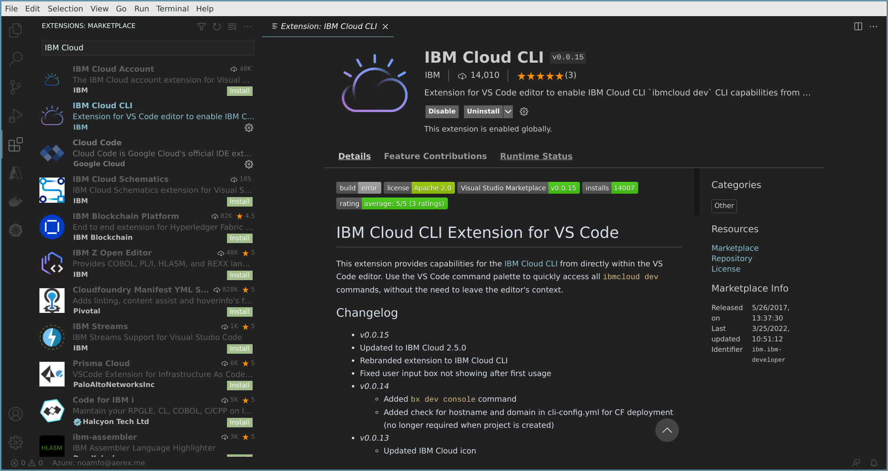

---

copyright:
  years: 2017, 2022
lastupdated: "2022-05-17"

keywords: cli, ibm cloud developer tools, visual studio code, developer extension, vscode cli, vscode plugin, vscode

subcollection: cli

---

{:shortdesc: .shortdesc}
{:screen: .screen}
{:codeblock: .codeblock}
{:pre: .pre}
{:note: .note}
{:deprecated: .deprecated}
{:important: .important}
{:tip: .tip}
{:external: target="_blank" .external}

# {{site.data.keyword.cloud_notm}} CLI for Microsoft Visual Studio Code
{: #ibm-dev-tools-for-vscode}

The {{site.data.keyword.cloud}} CLI extension for Microsoft&reg; Visual Studio Code provides access to capabilities from the {{site.data.keyword.cloud_notm}} Command Line Interface directly within the VS Code editor’s command palette.
{: shortdesc}

The extension supports the deployment of applications into VMs by using [{{site.data.keyword.containerlong_notm}}](/docs/containers?topic=containers-getting-started) or [Red Hat OpenShift on {{site.data.keyword.cloud_notm}}](/docs/openshift?topic=openshift-getting-started). The extension can be used for app deployment, starting/stopping/restarting apps on {{site.data.keyword.cloud_notm}}, viewing remote app logs, and more – all without the need to leave the editor’s context.

{: caption="Figure 1. Extension download screen within Visual Studio Code." caption-side="bottom"}

## Dependencies
{: #vscode-dependencies}

To use the {{site.data.keyword.cloud_notm}} CLI extension for Visual Studio Code, you need the [{{site.data.keyword.cloud_notm}} CLI](/docs/cli?topic=cli-getting-started) installed on your system.

## Installation
{: #vscode-installation}

The simplest way to install the {{site.data.keyword.cloud_notm}} CLI extension is to use Visual Studio Code’s `quick open` command:

1. Open the `quick open` command palette by using the following key combinations from within the editor:

   * **Mac:** `cmd + p`
   * **Windows&trade; / Linux&trade;:** `ctrl + p`

2. Enter the `ext install IBM Cloud CLI` command, and then press Enter to install the {{site.data.keyword.cloud_notm}} CLI extension inside the Visual Studio Code editor.

Or, you can install the {{site.data.keyword.cloud_notm}} CLI extension through the "Extensions" management window:

1. Open the **Extensions** sidebar in the Visual Studio Code editor, and then search by using the string `IBM Cloud CLI`. The {{site.data.keyword.cloud_notm}} CLI extension is displayed in the search results.  
2. Click **Install** to begin the installation.

You can also access the [{{site.data.keyword.cloud_notm}} CLI extension directly within the Visual Studio Code Marketplace](https://marketplace.visualstudio.com/items?itemName=IBM.ibm-developer){: external}.

## Usage
{: #vscode-usage}

Start the extension commands by using Visual Studio Code’s command palette.

First, open the command palette by using the following key combination:

* **Mac:** `cmd + shift + p`
* **Windows&trade; / Linux&trade;:** `ctrl + shift + p`

Next, either enter or select the command that you want to start. You can type `dev` within the command palette to see the list of all available commands.

From here, you can develop and deploy your application. For more information, see [Creating and deploying apps by using the CLI](/docs/apps?topic=apps-create-deploy-app-cli#create-deploy-app-cli).
