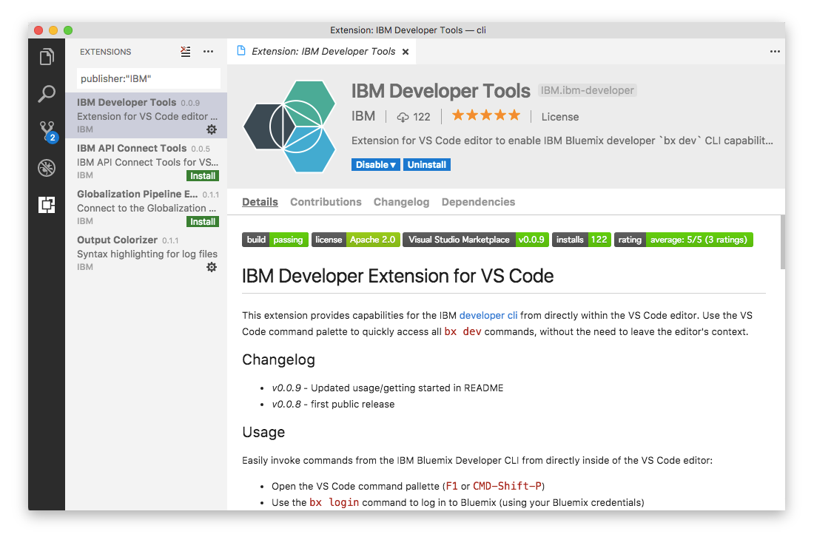

---

copyright:

  years: 2017, 2018

lastupdated: "2018-11-29"

---

{:shortdesc: .shortdesc}
{:codeblock: .codeblock}
{:screen: .screen}
{:new_window: target="_blank"}

# IBM Cloud Developer Tools for Visual Studio Code
{: #ibm-dev-tools-for-vscode}

The IBM Cloud Developer Tools extension for Visual Studio code is an extension for the editor that provides access to capabilities from the IBM developer CLI directly within the Visual Studio Code editor’s command palette. It allows you to quickly access a subset of `ibmcloud dev` commands for both Docker and CloudFoundry workflows, including app deployment, starting/stopping/restarting apps on {{site.data.keyword.Bluemix_notm}}, viewing remote app logs, and more – all without the need to leave the editor’s context.
{:shortdesc}

## Dependencies
{: #dependencies}

To use the IBM Cloud Developer Tools extension for Visual Studio Code, you need the [{{site.data.keyword.Bluemix_notm}} CLI](https://plugins.ng.bluemix.net/ui/home.html) and the [IBM Developer CLI](index.html) plug-in that is installed on your system.

## Installation
{: #installation}

The simplest way to install the IBM Cloud Developers Tools extension is to use Visual Studio Code’s 'quick open' command:

1. Open the 'quick open' command palette by using the following key combinations from within the editor:

  * **Mac:** `cmd + p`
  * **Windows / Linux:** `ctrl + p`

2. Enter the `ext install ibm-developer` command and press enter to install the IBM Cloud Developer Tools extension inside the Visual Studio Code editor.

Alternatively, you can install the IBM Cloud Developer Tools extension through the "Extensions" management window:

1. Open the **Extensions** sidebar inside of the Visual Studio Code editor, and then search by using the string `publisher:IBM Developer`. The IBM Cloud Developer Tools extension is displayed in the search results.  
2. Click the **Install** button to begin the installation.

You can also access the [IBM Cloud Developer Tools extension directly within the Visual Studio Code Marketplace](https://marketplace.visualstudio.com/items?itemName=IBM.ibm-developer).

## Usage
{: #usage}

You start the extension commands by using Visual Studio Code’s command palette.

First, open the command palette by using the following key combination:

* **Mac:** `cmd + shift + p`
* **Windows / Linux:** `ctrl + shift + p`

Next, you enter or select the command that you want to start. You can type ‘ibmcloud’ within the command palette to see the list of all available commands.

### Using the IBM Developer Extension for Docker workflows (Docker containers)
{: #usage-docker}

You can get started with `ibmcloud dev` workflows in just a few steps:
* Create a project by using one of the two following methods:
  * Use the [{{site.data.keyword.Bluemix_notm}} web console](https://{DomainName}/developer/appservice/starter-kits){: new_window}  and download the generated code
  * Use the [{{site.data.keyword.Bluemix_notm}} Developer CLI](index.html) and generate a project by using the `ibmcloud dev create` command
* Open the project’s folder locally in the Visual Studio Code editor
* Use the `ibmcloud dev build` command to build the app into a Docker image
* Use the `ibmcloud dev debug` command to run the app in local Docker for development
> Note: To debug a Node.js application that is running inside the local Docker container, you need to [add a debug configuration for the local container](https://github.com/IBM-Bluemix/ibm-developer-extension-vscode#debugging-nodejs-apps-within-the-local-docker-container).
* Use the `ibmcloud dev run` command to run the app in local Docker in release mode
* Use the `ibmcloud dev deploy` command to deploy the application to a Cloud Foundry runtime on {{site.data.keyword.Bluemix_notm}}

### Using the IBM Developer Extension for Cloud Foundry workflows
{: #usage-cloud-foundry}

For users that are currently deploying apps to Cloud Foundry runtimes on IBM {{site.data.keyword.Bluemix_notm}}, there is also support for the `cf` set of operations.

You can get started with CloudFoundry workflows in just a few steps:
* Create a new CloudFoundry application
  * Use the [{{site.data.keyword.Bluemix_notm}} web console](https://{DomainName}/developer/appservice/starter-kits){: new_window}  and download the starter code
  * Create a new CloudFoundry application manually
* Open the project folder locally in the Visual Studio Code editor
* Use `ibmcloud cf apps` to list all of your applications
* Use `ibmcloud cf push` to push a build of your application to the Cloud Foundry runtime
* Use ibmcloud `cf <start/stop/restage/restart>` to change the status of your application
* Use `ibmcloud cf logs` to view the live log stream for your application
  * Use `ibmcloud cf logs` to stop the log stream
