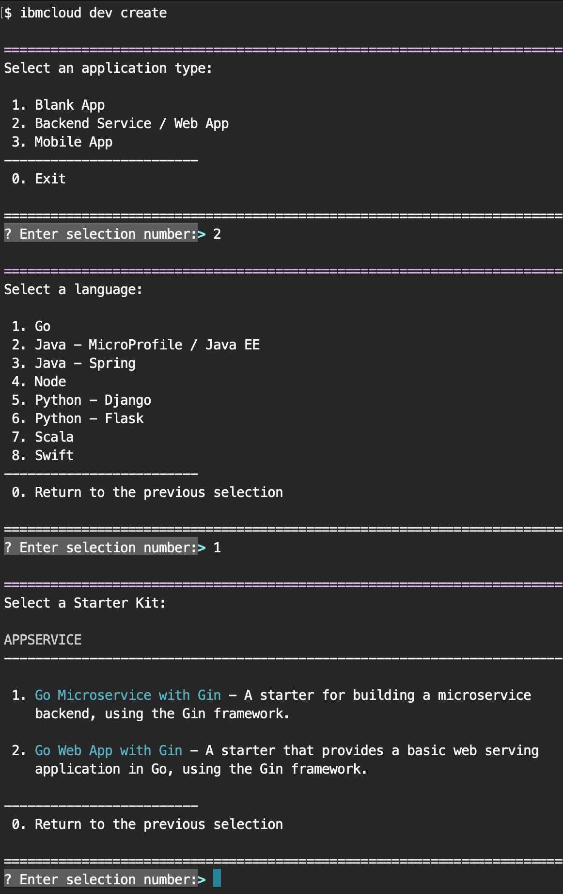

---

copyright:

  years: 2015, 2018

lastupdated: "2018-06-26"

---

{:shortdesc: .shortdesc}
{:codeblock: .codeblock}
{:screen: .screen}
{:tip: .tip}
{:new_window: target="_blank"}

# Getting started with {{site.data.keyword.dev_cli_notm}}
{: #overview}

{{site.data.keyword.dev_cli_notm}} is a command line approach for creating, developing, and deploying applications for developers who want to use a command line to develop end-to-end web, mobile, and microservice applications. Quickly get started with the recommended toolset by installing the following recommended tools for {{site.data.keyword.Bluemix_notm}} development (if not already installed):

- `Homebrew` (Mac only)
- `Git`
- `Docker`
- `Helm`
- `kubectl`
- `curl`
- {{site.data.keyword.Bluemix_notm}} CLI
- {{site.data.keyword.dev_cli_notm}} plug-in
- Cloud Functions plug-in
- Container Registry plug-in
- Container Service plug-in
- `sdk-gen` plug-in


## Before you begin with {{site.data.keyword.dev_cli_notm}}
{: #prereq}

Sign up for [{{site.data.keyword.Bluemix_notm}}](http://ibm.biz/ibm-registration).

* If you are using Microsoft Windows &trade;, you must use Windows 10 or later.

* You must use the stable channel for Docker, with a minimum version of 1.13.1.

## How to install {{site.data.keyword.dev_cli_notm}}
{: #installation}

To install the toolset, you can run the relevant command to start the installer.

**Mac and Linux:**

```
curl -sL https://ibm.biz/idt-installer | bash
```
{: codeblock}


**Windows 10:**

* Note: Open Windows PowerShell by right-clicking the PowerShell icon and selecting "Run as Administrator".

```
Set-ExecutionPolicy Unrestricted; iex(New-Object Net.WebClient).DownloadString('http://ibm.biz/idt-win-installer')
```
{: codeblock}

## Verify Installation
To verify installation, run the `help` command:

```
ibmcloud dev help
```
{: codeblock}

If installation was successful, the output should list usage instructions, the current version, and supported commands.

## Configure Your Environment
{: #configure-environment}

1. Connect to an API endpoint in your {{site.data.keyword.Bluemix_notm}} region. For example, enter the following command to connect to the {{site.data.keyword.Bluemix_notm}} US South region:

	```
	ibmcloud api https://api.ng.bluemix.net
	```
	{: codeblock}

2. Log in to {{site.data.keyword.Bluemix_notm}} with your IBMid.

	```
	ibmcloud login
	```
	{: codeblock}

	**Note:** If your credentials are rejected, you might be using a Federated ID. Follow these steps to authenticate by using a Federated ID.

	1. Log in to [{{site.data.keyword.iamshort}}](https://www.bluemix.net/iam/#/apikeys).
	2. Select **Create API key**.
		* Enter an apiKey name and description
	3. Download your apiKey.
	4. Open the file and copy the value from the `apiKey` field.
	5. Log in using the following command:

		```
		ibmcloud login --apikey <value>
		```
		{: codeblock}

3. Set your ORG and SPACE using:

	```
	ibmcloud target -o <value> -s <value>
	```
	{: codeblock}

## How to create your first {{site.data.keyword.Bluemix_notm}} application

Developing Cloud Native apps by using the {{site.data.keyword.dev_cli_notm}} CLI follows a fairly simple flow:

1. [Create or Enable an app](#create)
2. [Code, Build, and Run](#build) your app locally by using containers
3. [Deploy](#deploy) your app to the {{site.data.keyword.Bluemix_notm}}

## Create or Enable an App
{: #create}

There are several ways that you can create a Cloud app.
- [App Services web console](https://console.bluemix.net/developer/appservice) for generic web apps and microservices.
- [Watson Dashboard](https://console.bluemix.net/dashboard/watson) for creating Watson based capability enabled starter apps.
    - Other industry and technology-based dashboards are available from the "Hamburger" menu on the {{site.data.keyword.Bluemix_notm}} home page. All take a similar approach of using Starter Kits to create new apps.
- {{site.data.keyword.dev_cli_notm}} CLIs [`ibmcloud dev create`](/docs/cli/idt/commands.html#create) command to create a new app.
- {{site.data.keyword.dev_cli_notm}} CLIs [`ibmcloud dev enable`](/docs/cli/idt/commands.html#enable) command to quickly enable the cloud on an existing server-side app.

For any of the previous creation methods, the flow is similar. You can choose the project type, implementation language, and app pattern to use. You can also opt to add services with an added value to your app, such as authentication or persistence. Finally, you can choose to enable DevOps capability to the app that provides a complete toolchain of source control and team communications, and a pipeline that is triggered on each commit to validate, build, and deploy your app to the IBM Cloud.

 <br> Figure 2. Sample create flow using the IDT CLI

The {{site.data.keyword.dev_cli_notm}} CLI works closely together to provide a seamless experience during development. Projects that are created within any of the web consoles provide a "Download code" button to download the generated source code to your workstation for more development.

### Helpful CLI commands
{: #helpful}

The following CLI commands help in working with your project and the web consoles:
- [`code`](/docs/cli/idt/commands.html#code) to directly pull an apps generated source code to your workstation
- [`console`](/docs/cli/idt/commands.html#console) to open your browser to the current app's project page in the {{site.data.keyword.Bluemix_notm}}
- [`create`](/docs/cli/idt/commands.html#create) command to create a new app.
- [`delete`](/docs/cli/idt/commands.html#delete) to delete the current app from the {{site.data.keyword.Bluemix_notm}} project area.
- [`enable`](/docs/cli/idt/commands.html#enable) command to cloud-enable an existing server-side app.
- [`get-credentials`](/docs/cli/idt/commands.html#get-credentials) to get credentials that are required by the project to enable the use of bound services.
- [`list`](/docs/cli/idt/commands.html#list) to list all the apps that you have created in the currently selected org/space, from either the CLI or the consoles.

### Exploring the app's project structure
{: #exploring-project}

Projects that are created or enabled for use with the tool come with pre-configured settings encapsulated in the `cli-config.yml` file. The `cli-config.yml` contains default entries that are used by the commands of the tool that can be overridden by values that are passed through the command line.

More details on project structures can be found here:
- [Java projects](/docs/apps/projects/java_project_contents.html)
- [NodeJS projects](/docs/apps/projects/node_project_contents.html)
- [Python projects](/docs/apps/projects/python_project_contents.html)
- [Swift projects](/docs/apps/projects/swift_project_contents.html)

## Code, Build, and Run
{: #build}

Once your project has been created, it's now up to you to craft it into something useful. The general flow consists of editing the source code, then running a [`ibmcloud dev build`](/docs/cli/idt/commands.html#build) to compile the app within a local container specific to your app's language and configuration. Depending on your apps language and generator that is used, there are one or more containers defaulted to support building and running locally.  Typically, there will be a "tools" container for builds and local debugging.  This container will usually have extra tools and capabilities to aid you in development.  There is also a "run" container that closely mimics the actual runtime environment of your app once deployed to the cloud, either in Cloud Foundry or IBM's Kubernetes based container environment.


You are free to use whatever IDE or editor you prefer to code up your application. We offer an extension for the Microsoft VisualStudio Code (VSCode) editor that enables you to access all the IDE commands from directly within the editor.

Once the project has been built, you'll next want to run your app by using the [`ibmcloud dev run`](/docs/cli/idt/commands.html#run) or [`ibmcloud dev debug`](/docs/cli/idt/commands.html#debug), depending on your apps generator configuration.  This will run the app within the proper container.  Some apps patterns support multiple containers external to your apps such as persistence or other capabilities.  These will automatically be started and configured during run or debug.  There is also an [`ibmcloud dev test`](/docs/cli/idt/commands.html#test) command that will execute any test cases associated with the app.

### How local containers are used
{: #local-containers}

The {{site.data.keyword.dev_cli_long}} CLI uses two containers to facilitate building and testing your application. The first is the tools container, which contains the necessary utilities to build and test your application. The Dockerfile for this container is defined by the [`dockerfile-tools`](/docs/cli/idt/commands.html#command-parameters) parameter. You might think of it as a development container as it contains the tools normally used for development of a particular runtime.

The second container is the run container. This container is of a form suitable to be deployed for use, for example, in {{site.data.keyword.Bluemix}}. As a result, an entry point is defined that starts your application. When you select to run your application through the {{site.data.keyword.dev_cli_short}} CLI, it uses this container. The Dockerfile for this container is defined by the [`dockerfile-run`](/docs/cli/idt/commands.html#run-parameters) parameter.

### Helpful CLI commands
{: #helpful2}

The following CLI commands assist in working with your project during the code, build, and run cycles:
- [`build`](/docs/cli/idt/commands.html#build) Build the project in a local container
- [`debug`](/docs/cli/idt/commands.html#debug) Debug your application in a local container
- [`run`](/docs/cli/idt/commands.html#run) Run your application in a local container
- [`shell`](/docs/cli/idt/commands.html#shell) Open a shell into a local container
- [`status`](/docs/cli/idt/commands.html#status) Check the status of the containers used by the CLI
- [`stop`](/docs/cli/idt/commands.html#stop) Stop a container
- [`test`](/docs/cli/idt/commands.html#test) Test your application in a local container

## Deploy
{: #deploy}

Under a proper cloud native environment, you will want to utilize a fully functional DevOps pipeline to manage all deployments, as well as a wealth of other capabilities.  During the create flow, you can set up your app to use IBM Cloud's DevOps.  If you are not ready to use the built-in DevOps, then you can either manually [`ibmcloud dev deploy`](/docs/cli/idt/commands.html#deploy) your app, or use the deploy command within your own DevOps pipeline.  

### Helpful CLI commands
{: #helpful3}

The following CLI commands help in working with your project during the deploy process:
- [`console`](/docs/cli/idt/commands.html#console) Opens the IBM Cloud console for a project
- [`deploy`](/docs/cli/idt/commands.html#deploy) Deploy an application to IBM Cloud
- [`view`](/docs/cli/idt/commands.html#view) View the URL of your project


## Learn more about {{site.data.keyword.dev_cli_notm}}

- [IDT (ibmcloud dev) commands](/docs/cli/idt/commands.html#idt-cli)
- [Developer Tools for VS Code](/docs/cli/idt/vscode.html#ibm-dev-tools-for-vscode)
- [Developer Tools for Jetbrains IDEs](/docs/cli/idt/jetbrains.html#ibm-dev-tools-for-jetbrains)

Check out the [tutorials](/docs/apps/tutorials/tutorial_bff.html) that show how to create cloud native apps using {{site.data.keyword.dev_cli_short}} CLI.

The following resources can be helpful when developing Cloud Native apps with the IBM Developer Tools CLI:

- [IBM Cloud Developer Tools main landing page](https://www.ibm.com/cloud/cli) - Main product page for IDT CLI
- [IBM Developer Tools Installer](https://github.com/IBM-Bluemix/ibm-cloud-developer-tools) - Public GitHub repo with detailed installation instructions
- [IBM Cloud App Service](https://console.bluemix.net/developer/appservice) - IBM Cloud console page which is a companion to the IDT tools to create and manage cloud native apps

**Language focused**

- [Node.js on IBM Cloud](https://developer.ibm.com/node/cloud/)
- [Spring @ IBM Cloud](https://developer.ibm.com/java/spring/)
- [Swift @ IBM](https://developer.ibm.com/swift)

**Blogs and Tutorials**

- [Deploying to IBM Cloud private with IBM Cloud Developer Tools CLI](https://www.ibm.com/blogs/bluemix/2017/09/deploying-ibm-cloud-private-ibm-cloud-developer-tools-cli/)
- [Enable existing projects for IBM Cloud with the IBM Cloud Developer Tools CLI](https://www.ibm.com/blogs/bluemix/2017/09/enable-existing-projects-ibm-cloud-ibm-cloud-developer-tools-cli/)
- [Deploying to Kubernetes on IBM Cloud with the IBM Cloud Developer Tools CLI](https://www.ibm.com/blogs/bluemix/2017/09/deploying-kubernetes-ibm-cloud-ibm-cloud-developer-tools-cli/)
- Video: [Installing IDT on Ubuntu Linux](https://www.youtube.com/watch?v=sr7KjHAKpEs)
- Blog: [Enable existing projects for IBM Cloud with the IBM Cloud Developer Tools CLI](https://www.ibm.com/blogs/bluemix/2017/09/enable-existing-projects-ibm-cloud-ibm-cloud-developer-tools-cli/)

## Providing feedback for {{site.data.keyword.dev_cli_notm}}

- [Report issues on GitHub](https://github.com/IBM-Cloud/ibm-cloud-developer-tools/issues)
- [IBM Cloud Tech's Slack channel](https://ibm-cloud-tech.slack.com) - Request team access [here](https://slack-invite-ibm-cloud-tech.mybluemix.net/)
