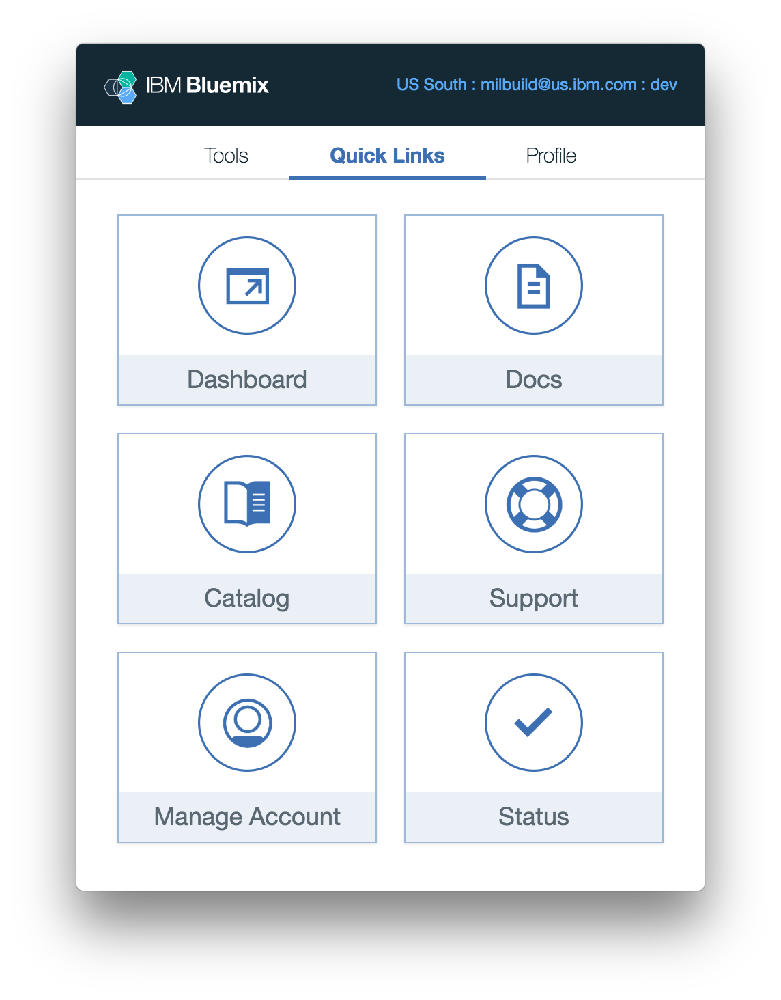

---

copyright:

  years: 2017

lastupdated: "2017-06-19"

---

{:shortdesc: .shortdesc}
{:codeblock: .codeblock}
{:screen: .screen}
{:new_window: target="_blank"}

# IBM Cloud Application Tools 2 (Beta)
{: #icat}

IBM Cloud Application Tools 2 ist eine Menüleistenanwendung, die für das Einrichten und Verwalten einer lokalen Umgebung unter macOS optimiert ist. IBM Cloud Application Tools 2 bietet komfortable Verfahren, um {{site.data.keyword.Bluemix_notm}}-Tools und -Befehlszeilenschnittstellen zu installieren und aktualisieren, um CLI-Bereitstellungsziele zu ändern und schnell auf allgemeine {{site.data.keyword.Bluemix_notm}}-Links zuzugreifen.
{:shortdesc}

Um mit der Arbeit beginnen zu können, [laden Sie IBM Cloud Application Tools 2 Beta für macOS herunter ](http://ibm.biz/icat-2-download){: new_window}. 

[Möchten Sie Feedback geben? ](http://ibm.biz/icat-2-feedback){: new_window}

## Features und Einstellungen

### Tools

Über die Registerkarte **Tools** können Sie die {{site.data.keyword.Bluemix_notm}}-Befehlszeilenschnittstelle und die Plug-ins für die Befehlszeilenschnittstelle installieren, aufrufen und aktualisieren. 

   Abbildung 1. Registerkarte **Tools** für die Verwaltung von CLIs und Plug-ins

### Quick Links

Über die Registerkarte **Quick Links** können Sie auf Links zu {{site.data.keyword.Bluemix_notm}}-Katalog und -Dashboard, Systemstatus und Kontenverwaltungseinstellungen sowie Produktdokumentation und Support aufrufen. 

   Abbildung 2. Registerkarte **Quick Links** für den Zugriff auf Konsole, Produktdokumentation und Support

### Profil

Über die Registerkarte **Profil** können Sie Benutzerkontovorgaben und Bereitstellungsziele verwalten. Beispiel: Durch Angabe einer anderen Region, einer anderen Organisation oder eines anderen Bereichs können Sie `bx target` für alle installierten Benutzerschnittstellen und Plug-ins ändern. Es gibt außerdem eine Option, mit der Sie von dieser Registerkarte aus Feedback geben können. 

   Abbildung 3. Registerkarte **Profil** für die Verwaltung von Benutzerkontovorgaben und CLI-Bereitstellungszielen

