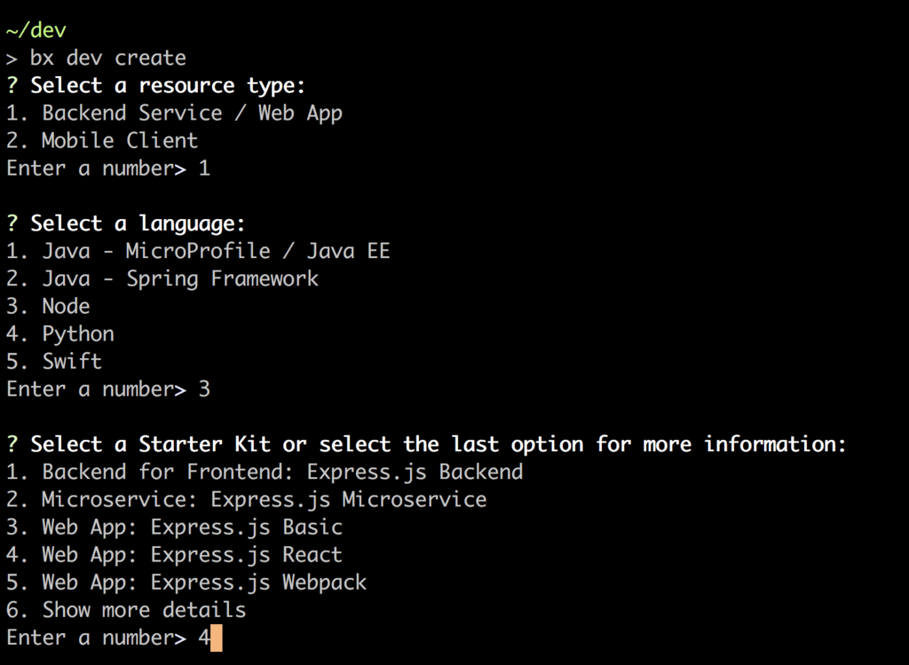

---
copyright:

  years: 2018

lastupdated: "2018-06-27"

---

{:new_window: target="_blank"}  
{:shortdesc: .shortdesc}  
{:screen: .screen}  
{:codeblock: .codeblock}  
{:pre: .pre}
{:tip: .tip}

# Apps entwickeln und bereitstellen
{: #developing}

Das Entwickeln von cloudnativen Apps mithilfe der {{site.data.keyword.dev_cli_notm}}-CLI ist ein relativ unkomplizierter Vorgang:

1. [App erstellen oder aktivieren](#create)
2. App lokal mithilfe von Containern [codieren, erstellen und ausführen](#build)
3. App in {{site.data.keyword.Bluemix_notm}} [bereitstellen](#deploy)

## App erstellen oder aktivieren
{: #create}

Es gibt verschiedene Wege, eine Cloud-App zu erstellen.
- [App Services-Webkonsole](https://console.bluemix.net/developer/appservice) für generische Web-Apps und Mikroservices
- [Watson-Dashboard](https://console.bluemix.net/dashboard/watson) für Starter-Apps, die für Watson-basierte Funktionalität aktiviert sind
    - Andere branchen- und technologiebasierte Dashboards sind verfügbar, wenn Sie auf der {{site.data.keyword.Bluemix_notm}}-Homepage auf die "Hamburger"-Menüschaltfläche klicken. Alle verfolgen denselben Ansatz des Einsatzes von Starter-Kits zum Erstellen neuer Apps.
- Befehl [`ibmcloud dev create`](./commands.html#create) der {{site.data.keyword.dev_cli_notm}}-Befehlszeilenschnittstelle (CLI) zum Erstellen einer neuen App.
- Befehl [`ibmcloud dev enable`](./commands.html#enable) der {{site.data.keyword.dev_cli_notm}}-Befehlszeilenschnittstelle (CLI) zum raschen Aktivieren der Cloud in einer vorhandenen serverseitigen App.

Für alle oben aufgeführten Erstellungsmethoden ist der Ablauf derselbe. Sie können den Projekttyp, die Implementierungssprache und das zu verwendende App-Muster auswählen. Sie können auch Services mit Mehrwert wie Authentifizierung oder Persistenz zu Ihrer App hinzufügen. Schließlich können Sie DevOps-Funktionalität für die App aktivieren, die eine vollständige Toolchain von Quellcodeverwaltung bis Teamkommunikation liefert sowie eine Pipeline, die bei jedem Commit ausgelöst wird, um Ihre App zu validieren, zu erstellen und in der IBM Cloud bereitzustellen.

   Abbildung 2. Beispielablauf für das Erstellen mit IDT-CLI

Die {{site.data.keyword.dev_cli_notm}}-CLI ist nahtlos integriert für eine möglichst benutzerfreundliche Entwicklung. Projekte, die in einer der Webkonsolen erstellt werden, haben eine Schaltfläche 'Code herunterladen', um den generierten Quellcode zur weiteren Entwicklung auf Ihre Workstation herunterzuladen.

### Hilfreiche CLI-Befehle
{: #helpful}

Die folgenden CLI-Befehle unterstützen Sie bei der Arbeit mit Ihrem Projekt und den Webkonsolen:
- [`code`](./commands.html#code) für das direkte Herunterladen des generierten Quellcodes einer App auf Ihre Workstation.
- [`console`](./commands.html#console) für das Öffnen Ihres Browsers auf der Projektseite der aktuellen App in {{site.data.keyword.Bluemix_notm}}.
- [`create`](./commands.html#create) für das Erstellen einer neuen App.
- [`delete`](./commands.html#delete) für das Löschen der aktuellen App aus dem {{site.data.keyword.Bluemix_notm}}-Projektbereich.
- [`enable`](./commands.html#enable) für das Bereitstellen einer vorhandenen serverseitigen App in der Cloud.
- [`get-credentials`](./commands.html#get-credentials) für das Abrufen von für das Projekt erforderlichen Berechtigungsnachweisen zum Aktivieren der Verwendung von gebundenen Services.
- [`list`](./commands.html#list) für das Auflisten aller Apps, die Sie in der/dem aktuell ausgewählten Organisation/Bereich erstellt haben, entweder über die CLI oder die Konsolen.

### Untersuchen der Projektstruktur der App
{: #exploring-project}

Projekte, die für die Verwendung mit dem Tool erstellt oder aktiviert werden, haben vorkonfigurierte Einstellungen in der Datei `cli-config.yml`. Die Datei `cli-config.yml` enthält Standardeinträge, die von den Befehlen des Tools verwendet werden, die durch an die Befehlszeile übergebene Werte überschrieben werden können.

Weitere Details zu Projektstrukturen finden Sie hier:
- [Java-Projekte](/docs/apps/projects/java_project_contents.html)
- [NodeJS-Projekte](/docs/apps/projects/node_project_contents.html)
- [Python-Projekte](/docs/apps/projects/python_project_contents.html)
- [Swift-Projekte](/docs/apps/projects/swift_project_contents.html)

### Referenz-Blogs und -Videos
{: #ref1}

- Video: [IDT unter Ubuntu Linux installieren](https://www.youtube.com/watch?v=sr7KjHAKpEs)
- Blog: [Enable existing projects for IBM Cloud with the IBM Cloud Developer Tools CLI](https://www.ibm.com/blogs/bluemix/2017/09/enable-existing-projects-ibm-cloud-ibm-cloud-developer-tools-cli/)

## Codieren, Erstellen und Ausführen
{: #build}

Sobald Ihr Projekt erstellt wurde, können Sie es für Ihre Zwecke anpassen. Der grundsätzliche Ablauf besteht aus dem Bearbeiten des Quellcodes und dem anschließenden Ausführen von [`ibmcloud dev build`](commands.html#build), um die App in einem lokalen Container, der spezifisch für die Sprache und Konfiguration Ihrer App ist, zu kompilieren. Abhängig von der Sprache und dem Generator Ihrer Apps können mehrere Container verfügbar sein, die die Erstellung und lokale Ausführung unterstützen.  Typischerweise gibt es einen Container 'tools' für Builds und lokales Debugging. Dieser Container enthält üblicherweise zusätzliche Tools und Funktionalitäten, die Sie bei der Entwicklung unterstützen. Es gibt auch einen Container 'run', der die tatsächliche Laufzeit Ihrer App abbildet, sobald sie in der Cloud bereitgestellt wurde - entweder in Cloud Foundry oder in einer Kubernetes-basierten Containerumgebung von IBM.

Sie können eine beliebige IDE oder einen beliebigen Editor verwenden, um Ihre Anwendung zu codieren. Wir bieten eine Erweiterung für den Microsoft VisualStudio Code-Editor (VSCode), in dem Sie direkt auf alle IDE-Befehle zugreifen können.

Nachdem das Projekt erstellt worden ist, führen Sie Ihre App abhängig von der Konfiguration ihres Generators mit dem Befehl [`ibmcloud dev run`](commands.html#run) oder dem Befehl [`ibmcloud dev debug`](commands.html#debug) aus. Die App wird im passenden Container ausgeführt. Manche Apps unterstützen mehrere Container, die nicht Teil Ihrer Apps sind, wie Persistenz oder andere Funktionen. Diese werden während der Ausführung automatisch gestartet und konfiguriert. Außerdem gibt es auch einen Befehl [`ibmcloud dev test`](commands.html#test), der alle Testfälle im Zusammenhang mit der App ausführt.

### Vorgehensweise zur Verwendung lokaler Container
{: #local-containers}

Die {{site.data.keyword.dev_cli_long}}-CLI verwendet zwei Container, um das Erstellen und Testen Ihrer Anwendung zu vereinfachen. Der erste ist der Container 'tools', der die erforderlichen Dienstprogramme zum Erstellen und Testen Ihrer Anwendung enthält. Die Dockerfile für diesen Container ist durch den Parameter [`dockerfile-tools`](commands.html#command-parameters) definiert. Sie können ihn als Entwicklungscontainer ansehen, da er die Tools enthält, die üblicherweise für die Entwicklung einer bestimmten Laufzeit verwendet werden.

Der zweite Container ist der Container 'run'. Dieser Container hat ein Format, das beispielsweise für die Verwendung in {{site.data.keyword.Bluemix}} geeignet ist. In der Folge wird ein Eingangspunkt definiert, der Ihre Anwendung startet. Wenn Ihre Anwendung über die {{site.data.keyword.dev_cli_short}}-CLI ausgeführt werden soll, verwendet sie diesen Container. Die Dockerfile für diesen Container ist durch den Parameter [`dockerfile-run`](commands.html#run-parameters) definiert.

### Hilfreiche CLI-Befehle
{: #helpful2}

Die folgenden CLI-Befehle unterstützen Sie bei der Arbeit mit Ihrem Projekt während der Codierungs-, Erstellungs- und Ausführungszyklen.
- [`build`](./commands.html#build) Erstellt das Projekt in einem lokalen Container.
- [`debug`](./commands.html#debug) Debuggt Ihre Anwendung in einem lokalen Container.
- [`run`](./commands.html#run) Führt Ihre Anwendung in einem lokalen Container aus.
- [`shell`](./commands.html#shell) Öffnet eine Shell in einen lokalen Container.
- [`status`](./commands.html#status) Prüft den Status der von der Befehlszeilenschnittstelle verwendeten Container.
- [`stop`](./commands.html#stop) Stoppt einen Container.
- [`test`](./commands.html#test) Testet Ihre Anwendung in einem lokalen Container.

### Referenz-Blogs und -Videos
{: #ref2}

- [Lokale Apps debuggen](local_debug.html)

## Bereitstellen
{: #deploy}

In einer ordnungsgemäßen cloudnativen Umgebung können Sie eine voll funktionsfähige DevOps-Pipeline nutzen, um alle Bereitstellungen sowie eine Vielzahl weiterer Funktionen zu verwalten. Während des Erstellens können Sie Ihre App für die Verwendung mit DevOps von IBM Cloud einrichten. Wenn Sie nicht bereit sind, die integrierten DevOps zu nutzen, können Sie Ihre App entweder manuell mit [`ibmcloud dev deploy`](./commands.html#deploy) bereitstellen oder den 'deploy'-Befehl innerhalb Ihrer eigenen DevOps-Pipeline verwenden.  

### Hilfreiche CLI-Befehle
{: #helpful3}

Die folgenden CLI-Befehle unterstützen Sie bei der Arbeit mit Ihrem Projekt während des Bereitstellungsprozesses:
- [`console`](./commands.html#console) Öffnet die IBM Cloud-Konsole für ein Projekt.
- [`deploy`](./commands.html#deploy) Stellt eine Anwendung in IBM Cloud bereit.
- [`view`](./commands.html#view) Zeigt die URL Ihres Projekts an.

### Referenz-Blogs und -Videos
{: #ref3}

- Blog: [Deploying to IBM Cloud Private with IBM Cloud Developer Tools CLI](https://www.ibm.com/blogs/bluemix/2017/09/deploying-ibm-cloud-private-ibm-cloud-developer-tools-cli/)
- Blog: [Deploying to Kubernetes on IBM Cloud with the IBM Cloud Developer Tools CLI](https://www.ibm.com/blogs/bluemix/2017/09/deploying-kubernetes-ibm-cloud-ibm-cloud-developer-tools-cli/)
