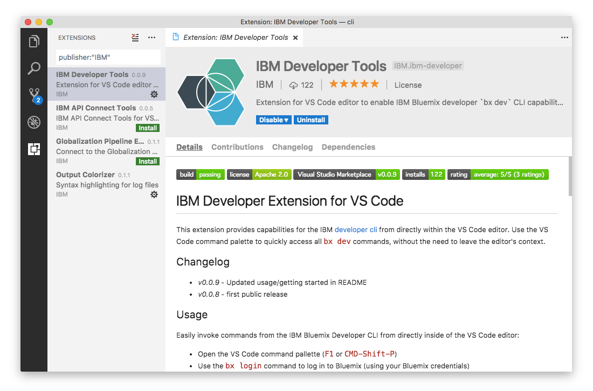

---

copyright:

  years: 2017, 2018

lastupdated: "2018-06-21"

---

{:shortdesc: .shortdesc}
{:codeblock: .codeblock}
{:screen: .screen}
{:new_window: target="_blank"}

# IBM Developer Tools für Visual Studio Code
{: #ibm-dev-tools-for-vscode}

Die IBM Developer-Erweiterung für Visual Studio Code ist eine Erweiterung für den Editor, der Zugriff auf Funktionen aus der IBM Developer-CLI direkt in der Befehlspalette des Visual Studio Code-Editors bereitstellt Sie ermöglicht schnellen Zugriff auf eine Teilmenge der `ibmcloud dev`-Befehle sowohl für Docker- als auch für CloudFoundry-Workflows, einschließlich App-Bereitstellung, Starten/Stoppen/Neustarten von Apps in {{site.data.keyword.Bluemix_notm}}, Anzeigen von Protokollen ferner Apps und vieles mehr – ohne den Kontext des Editors dafür verlassen zu müssen.
{:shortdesc}

## Abhängigkeiten
{: #dependencies}

Um die IBM Developer Tools-Erweiterung für Visual Studio Code nutzen zu können, müssen die Plug-ins für die [{{site.data.keyword.Bluemix_notm}}-CLI](https://plugins.ng.bluemix.net/ui/home.html) und die [IBM Developer-CLI](index.html) auf Ihrem System installiert sein.

## Installation
{: #installation}

Der einfachste Weg, die IBM Developers Tools-Erweiterung zu installieren, ist die Verwendung des Visual Studio Code-Befehls 'Quick Open':

1. Öffnen Sie die 'quick open'-Befehlspalette im Editor mit den folgenden Tastenkombinationen:

  * **Mac:** `cmd + p`
  * **Windows/Linux:** `strg + p`

2. Geben Sie den Befehl `ext install ibm-developer` ein und drücken Sie die Eingabetaste,, um die IBM Developer Tools-Erweiterung im Visual Studio Code-Editor zu installieren.

Alternativ können Sie die IBM Developer Tools-Erweiterung über das Verwaltungsfenster "Erweiterungen" installieren:

1. Öffnen Sie die Seitenleiste **Erweiterungen** im Visual Studio Code-Editor und suchen Sie dann nach der Zeichenfolge `publisher:IBM Developer`. Die IBM Developer Tools-Erweiterung wird in den Suchergebnissen angezeigt.  
2. Klicken Sie auf die Schaltfläche **Installieren**, um die Installation zu starten.

Sie können auch direkt auf die [IBM Developer Tools-Erweiterung in Visual Studio Code Marketplace zugreifen](https://marketplace.visualstudio.com/items?itemName=IBM.ibm-developer).

## Verwendung
{: #usage}

Sie können die Befehle der Erweiterung über die Befehlspalette von Visual Studio Code starten.

Öffnen Sie zunächst die Befehlspalette mithilfe der folgenden Tastenkombinationen:

* **Mac:** `cmd + shift + p`
* **Windows/Linux:** `strg + umschalt + p`

Geben Sie dann den zu startenden Befehl ein oder wählen Sie ihn aus. Sie können 'ibmcloud' in der Befehlspalette eingeben, um eine Liste aller verfügbaren Kommentare anzuzeigen.

### IBM Developer-Erweiterung for Docker-Workflows (Docker-Container) verwenden
{: #usage-docker}

Sie können die Arbeit mit 'ibmcloud dev'-Workflows in nur wenigen Schritten beginnen:
* Erstellen Sie ein Projekt mithilfe einer der beiden folgenden Methoden: 
  * Öffnen Sie die [{{site.data.keyword.Bluemix_notm}}-Webkonsole](https://console.ng.bluemix.net/developer/getting-started/) und laden Sie den generierten Code herunter.
  * Verwenden Sie die [{{site.data.keyword.Bluemix_notm}} Developer-CLI](index.html) und generieren Sie ein Projekt mithilfe des Befehls `ibmcloud dev create`.
* Öffnen Sie den Projektordner lokal im Visual Studio Code-Editor.
* Verwenden Sie den Befehl `ibmcloud dev build`, um die App in einem Docker-Image zu erstellen.
* Verwenden Sie den Befehl `ibmcloud dev debug`, um die App in einer lokalen Docker-Instanz für die Entwicklung auszuführen.
> Hinweis: Zum Debuggen einer Node.js-Anwendung, die in einem lokalen Docker-Container ausgeführt wird, müssen Sie [eine Debugkonfiguration für den lokalen Container hinzufügenn](https://github.com/IBM-Bluemix/ibm-developer-extension-vscode#debugging-nodejs-apps-within-the-local-docker-container).
* Verwenden Sie den Befehl `ibmcloud dev run`, um die App in einer lokalen Docker-Instanz im Freigabemodus auszuführen.
* Verwenden Sie den Befehl `ibmcloud dev deploy`, um die Anwendung in einer Cloud Foundry-Laufzeitumgebung unter {{site.data.keyword.Bluemix_notm}} bereitzustellen.

### IBM Developer-Erweiterung für Cloud Foundry-Workflows verwenden
{: #usage-cloud-foundry}

Für Benutzer, die zurzeit Apps für Cloud Foundry-Laufzeitumgebungen unter IBM {{site.data.keyword.Bluemix_notm}} bereitstellen, ist auch Unterstützung für `cf`-Operationen verfügbar.

Sie können die Arbeit mit CloudFoundry-Workflows in nur wenigen Schritten beginnen:
* Erstellen Sie eine neue CloudFoundry-Anwendung.
  * Öffnen Sie die [Webkonsole](https://console.ng.bluemix.net/dashboard/cf-apps) und laden Sie den Startcode herunter.
  * Erstellen Sie manuell eine neue CloudFoundry-Anwendung.
* Öffnen Sie den Projektordner lokal im Visual Studio Code-Editor.
* Verwenden Sie `ibmcloud cf apps`, um alle Ihre Anwendungen aufzulisten.
* Verwenden Sie `ibmcloud cf push`, um ein Build Ihrer Anwendung in die Cloud Foundry-Laufzeit per Push-Operation zu übertragen.
* Verwenden Sie ibmcloud `cf <start/stop/restage/restart>`, um den Status Ihrer Anwendung zu ändern.
* Verwenden Sie `ibmcloud cf logs`, um den Live-Protokolldatenstrom für Ihre Anwendung anzuzeigen.
  * Verwenden Sie `ibmcloud cf logs`, um den Protokolldatenstrom zu stoppen.
