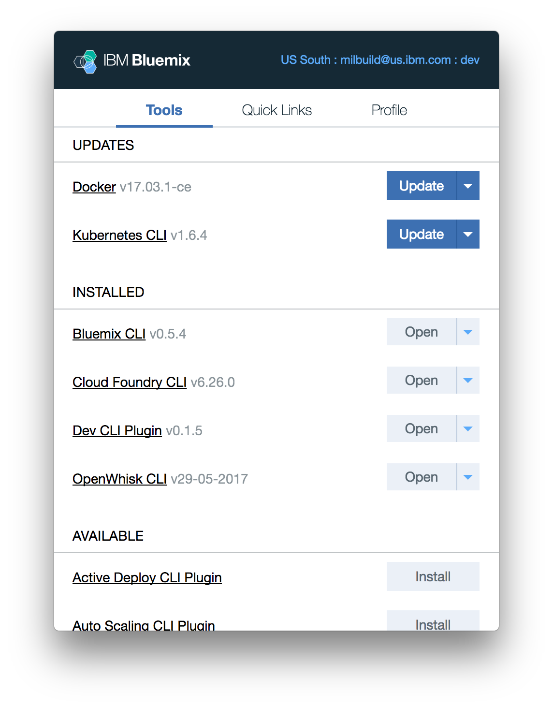
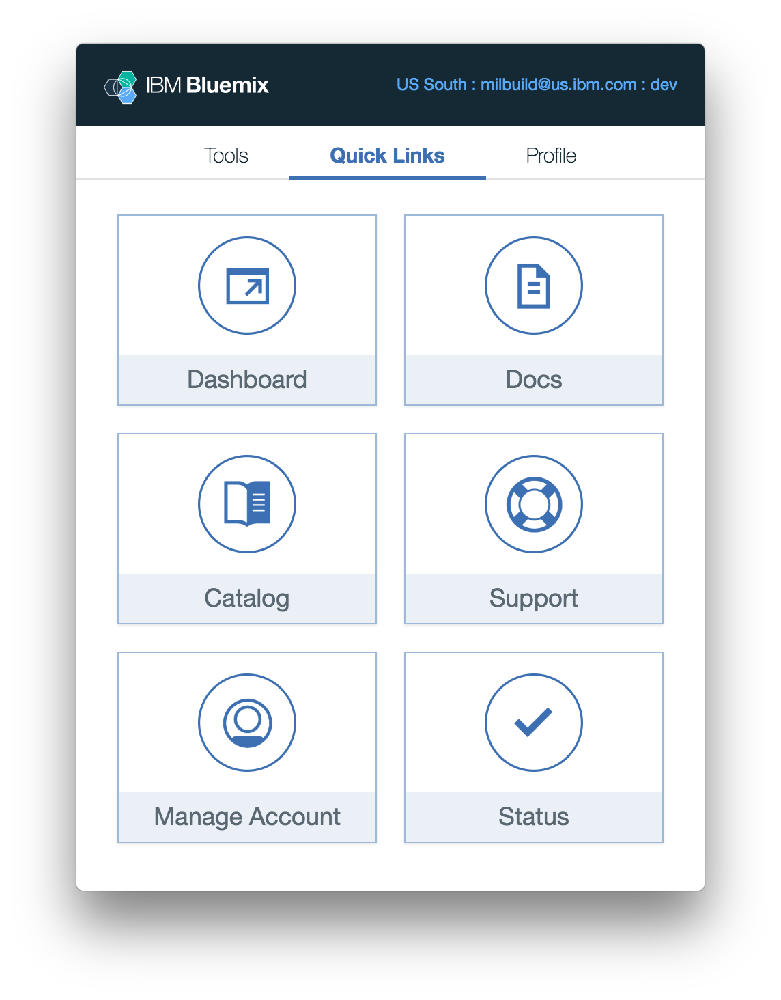

---

copyright:

  years: 2017

lastupdated: "2017-06-19"

---

{:shortdesc: .shortdesc}
{:codeblock: .codeblock}
{:screen: .screen}
{:new_window: target="_blank"}

# IBM Cloud Application Tools 2 (Beta)
{: #icat}

IBM Cloud Application Tools 2 es una aplicación de la barra de menús que se ha simplificado para la configuración del entorno local y la gestión en macOS. Si utiliza IBM Cloud Application Tools 2, puede instalar y actualizar fácilmente las herramientas y las CLI de {{site.data.keyword.Bluemix_notm}}, cambiar los destinos de despliegue de la CLI y acceder rápidamente a enlaces habituales de {{site.data.keyword.Bluemix_notm}}.
{:shortdesc}

Para empezar rápidamente, [descargue IBM Cloud Application Tools 2 Beta para macOS ](http://ibm.biz/icat-2-download){: new_window}. 

[¿Desea proporcionar comentarios? ](http://ibm.biz/icat-2-feedback){: new_window}

## Características y valores

### Herramientas

En el separador **Herramientas**, puede instalar, acceder y actualizar la CLI de {{site.data.keyword.Bluemix_notm}} y los plugins de la interfaz de línea de mandatos. 

   Figura 1. Separador **Herramientas** para gestionar CLI y plugins

### Enlaces rápidos

En el separador **Enlaces rápidos**, puede acceder a los enlaces con el catálogo y paneles de instrumentos de {{site.data.keyword.Bluemix_notm}}, el estado del sistema y los valores de gestión de cuentas, y a la documentación del producto y soporte. 

   Figura 2. Separador **Enlaces rápidos** para acceder a la consola, documentación del producto y soporte

### Perfil

En el separador **Perfil**, puede gestionar preferencias de la cuenta de usuario y destinos de despliegue. Por ejemplo, especificando una región diferente, org, o un espacio, puede modificar el `destino bx` para todas las CLI y todos los plug-ins instalados. También existe una opción para proporcionar comentarios desde este separador. 

   Figura 3. Separador **Perfil** para gestionar preferencias de la cuenta de usuario y destinos de despliegue de la CLI

