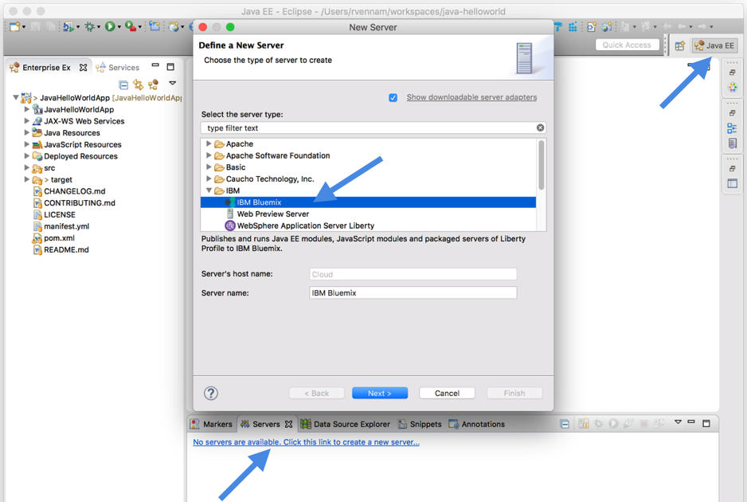

---

copyright:

  years: 2015，2017

lastupdated: "2018-06-20"

---

{:download: .download}
{:new_window: target="_blank"}
{:shortdesc: .shortdesc}

# Sviluppo mediante Eclipse Tools

{{site.data.keyword.eclipsetoolsfull}} fornisce
dei leggeri strumenti in Eclipse per uno sviluppo e un'integrazione rapidi di applicazioni con cloud {{site.data.keyword.Bluemix}} o
Cloud Foundry.
{:shortdesc}

  1. Se non disponi già di Eclipse, installa Eclipse Neon for Java EE Developers (4.6.1).
  
  2. Fai clic e tieni premuto il seguente pulsante per trascinarlo e rilasciarlo nella barra degli strumenti Eclipse e segui quindi le richieste che ti vengono presentate per installare IBM Eclipse Tools for {{site.data.keyword.Bluemix_notm}}:

  

  3. Conferma di essere nella prospettiva di Java EE e crea un server {{site.data.keyword.Bluemix_notm}} nella scheda Server.

  

  4. Distribuisci la tua applicazione a {{site.data.keyword.Bluemix_notm}} facendo clic con il tasto destro del mouse sul server {{site.data.keyword.Bluemix_notm}} e selezionando **Aggiungi e Rimuovi**.

Per istruzioni dettagliate relative alla distribuzione delle applicazioni, vedi [Distribuzione di applicazioni con IBM Eclipse Tools for {{site.data.keyword.Bluemix_notm}} ](/docs/manageapps/eclipsetools/eclipsetools.html#eclipsetools){: new_window}.
