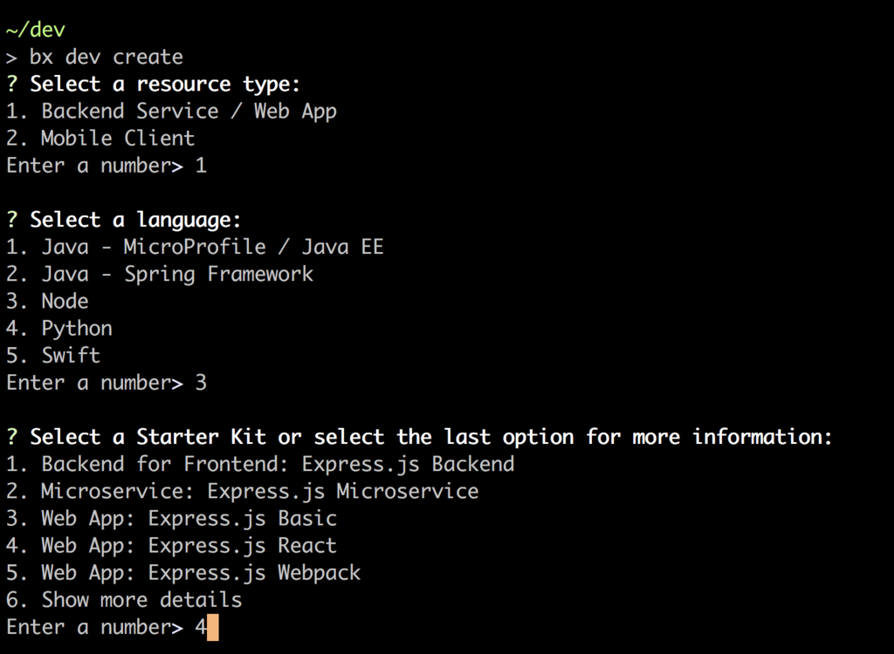

---
copyright:

  years: 2018

lastupdated: "2018-03-16"

---

{:new_window: target="_blank"}  
{:shortdesc: .shortdesc}  
{:screen: .screen}  
{:codeblock: .codeblock}  
{:pre: .pre}  

# Utilizzo di {{site.data.keyword.dev_cli_notm}}
{: developing}

Lo sviluppo applicazioni native cloud utilizzando {{site.data.keyword.dev_cli_notm}} segue un flusso abbastanza semplice: 

1. [Crea o abilita un'applicazione](#create)
2. [Codifica, crea ed esegui](#build) la tua applicazione localmente utilizzando i contenitori
3. [Distribuisci](#deploy) la tua applicazione a {{site.data.keyword.Bluemix_notm}}

## Crea o abilita un'applicazione 
{: #create}

Esistono diversi modi per creare un'applicazione Cloud. 
- [Console web dei servizi dell'applicazione](https://console.bluemix.net/developer/appservice) per i microservizi e le applicazioni web generici
- [Dashboard Watson](https://console.bluemix.net/dashboard/watson) per la creazione di applicazioni starter abilitate alle funzionalità basate su Watson.
    - Altri dashboard basati sull'industria e la tecnologia sono disponibili dal menu "Hamburger" nella homepage {{site.data.keyword.Bluemix_notm}}. Hanno tutti un approccio simile all'utilizzo dei kit starter per creare nuove applicazioni.
- Per la CLI {{site.data.keyword.dev_cli_notm}} il comando [`bx dev create`](./commands.html#create) crea una nuova applicazione.
- Per la CLI {{site.data.keyword.dev_cli_notm}} il comando [`bx dev enable`](./commands.html#enable) abilita velocemente il cloud per un'applicazione lato server esistente.

Per ognuno dei metodi di creazione precedenti, il flusso è simile. Puoi scegliere il tipo di progetto, il linguaggio di implementazione e il modello dell'applicazione da utilizzare. Puoi anche scegliere di aggiungere servizi di valore aggiunto alla tua applicazione, come l'autenticazione o la persistenza. Infine, puoi scegliere di abilitare la funzionalità DevOps all'applicazione che fornisce una toolchain completa del controllo di origine e le comunicazioni con il team, nonché una pipeline che viene attivata ad ogni commit per convalidare, creare e distribuire la tua applicazione a IBM Cloud.

   Figura 2. Esempio di flusso di creazione utilizzando la CLI IDT

La CLI {{site.data.keyword.dev_cli_notm}} lavora a stretto contatto per fornire un'esperienza ottimale durante lo sviluppo. I progetti creati in qualsiasi console web forniscono un pulsante "Scarica codice" per scaricare il codice di origine generato sulla tua workstation per un ulteriore sviluppo. 

### Comandi CLI utili 
I seguenti comandi CLI consentono di lavorare con il tuo progetto e le console web: 
- [`code`](./commands.html#enable) per eseguire direttamente il pull del codice di origine generato dall'applicazione alla tua workstation
- [`console`](./commands.html#console) per aprire il tuo browser alla pagina del progetto dell'applicazione corrente in {{site.data.keyword.Bluemix_notm}}
- [comando `create`](./commands.html#create) per creare una nuova applicazione.
- [`delete`](./commands.html#delete) per eliminare l'applicazione corrente dall'area del progetto {{site.data.keyword.Bluemix_notm}}.
- [comando `enable`](./commands.html#enable) per abilitare nel cloud un'applicazione lato server esistente.
- [`get-credentials`](./commands.html#get-credentials) per ottenere le credenziali richieste dal progetto per abilitare l'utilizzo di servizi associati.
- [`list`](./commands.html#list) per elencare tutte le applicazioni che hai creato nell'organizzazione o spazio attualmente selezionati, dalla CLI o dalle console.

### Esplorazione della struttura del progetto dell'applicazione 
{: exploring-project}

I progetti creati o abilitati per l'utilizzo con lo strumento sono forniti con le impostazioni preconfigurate incapsulate nel file `cli-config.yml`. `cli-config.yml` contiene le voci predefinite utilizzate dai comandi dello strumento, che possono essere sovrascritte dai valori passati attraverso la riga di comando.

Ulteriori dettagli sulle strutture del progetto possono essere trovate qui: 
- [Progetti Java](/docs/apps/projects/java_project_contents.html)
- [Progetti NodeJS](/docs/apps/projects/node_project_contents.html)
- [Progetti Python](/docs/apps/projects/python_project_contents.html)
- [Progetti Swift](/docs/apps/projects/swift_project_contents.html)

### Video e blog di riferimento
- Video: [Installazione di IDT su Ubuntu Linux]()
- Blog: [Enable existing projects for IBM Cloud with the IBM Cloud Developer Tools CLI](https://www.ibm.com/blogs/bluemix/2017/09/enable-existing-projects-ibm-cloud-ibm-cloud-developer-tools-cli/)

## Codifica, crea ed esegui 
{: #build}

Una volta che il tuo progetto è stato creato, è pronto per diventare qualcosa di utile. Il flusso generale consiste di modificare il codice di origine, quindi esegui [`bx dev build`](commands.html#build) per compilare l'applicazione in un contenitore locale specifico per il linguaggio e la configurazione della tua applicazione. A seconda del linguaggio e del generatore della tua applicazione utilizzati, ci sono uno o più contenitori predefiniti per supportare la creazione e l'esecuzione localmente. Di solito, ci sarà un contenitore "degli strumenti" per le build e il debug locale. Questo contenitore normalmente avrà ulteriori strumenti e funzionalità per aiutarti nello sviluppo.  Esiste inoltre un contenitore "di esecuzione" che simula più attentamente l'attuale ambiente di runtime della tua applicazione dopo che è stata distribuita nel cloud, in Cloud Foundry o in un ambiente del contenitore basato su Kubernetes di IBM.

Sei libero di utilizzare qualsiasi IDE o editor preferisci per codificare la tua applicazione. Offriamo un'estensione per l'editor Microsoft VisualStudio Code (VSCode) che ti consente di accedere a tutti i comandi IDE direttamente nell'editor. 

Una volta che è stato creato il progetto, vorrai eseguire la tua applicazione utilizzando [`bx dev run`](commands.html#run) o [`bx dev debug`](commands.html#debug), a seconda della configurazione del generatore della tua applicazione.  Questo eseguirà l'applicazione nel contenitore corretto. Alcuni modelli delle applicazioni supportano più contenitori esterni alle tue applicazioni come la persistenza o altre funzionalità. Questi saranno automaticamente avviati e configurati durante l'esecuzione o il debug. Esiste inoltre un comando [`bx dev test`](commands.html#test) che eseguirà tutti gli scenari di test associati all'applicazione.

### Come vengono utilizzati i contenitori locali 
{: local-containers}

{{site.data.keyword.dev_cli_long}} utilizza due contenitori per facilitare la creazione e la verifica della tua applicazione. Il primo è il contenitore degli strumenti, che contiene i programmi di utilità necessari per creare e verificare la tua applicazione. Il Dockerfile per questo contenitore è definito dal parametro [`dockerfile-tools`](commands.html#command-parameters). Potresti vederlo come un contenitore di sviluppo poiché contiene gli strumenti utilizzati normalmente per lo sviluppo di uno specifico runtime. 

Il secondo contenitore è il contenitore di esecuzione. Questo contenitore è di un formato adeguato per essere distribuito per l'utilizzo, ad esempio, in {{site.data.keyword.Bluemix}}. Di conseguenza, viene definito un punto di ingresso che avvia la tua applicazione. Quando selezioni di eseguire la tua applicazione tramite la {{site.data.keyword.dev_cli_short}}, utilizza questo contenitore. Il Dockerfile per questo contenitore è definito dal parametro [`dockerfile-run`](commands.html#run-parameters). 

### Comandi CLI utili 
I seguenti comandi CLI consentono di lavorare con il tuo progetto durante i cicli di codifica, creazione ed esecuzione del codice: 
- [`build`](./commands.html#build) crea il progetto in un contenitore locale
- [`debug`](./commands.html#debug) esegue il debug della tua applicazione in un contenitore locale
- [`run`](./commands.html#run) esegue la tua applicazione in un contenitore locale
- [`shell`](./commands.html#shell) apre una shell in un contenitore locale
- [`status`](./commands.html#status) controlla lo stato dei contenitori utilizzati dalla CLI
- [`stop`](./commands.html#stop) arresta un contenitore
- [`test`](./commands.html#test) verifica la tua applicazione in un contenitore locale

### Video e blog di riferimento
- [Debug delle applicazioni locali](local_debug.html)

## Distribuisci
{: deploy}

In un ambiente nativo cloud appropriato, vorrai utilizzare una pipeline DevOps completamente funzionale per gestire tutte le distribuzioni, nonché un gran numero di altre funzionalità.  Durante il flusso di creazione, puoi configurare la tua applicazione per l'utilizzo di DevOps di IBM Cloud. Se non sei pronto a utilizzare i DevOps integrati, puoi manualmente eseguire [`bx dev deploy`](./commands.html#deploy) per la tua applicazione o utilizzare il comando di distribuzione nella tua pipeline DevOps.  

### Comandi CLI utili 
I seguenti comandi CLI consentono di lavorare con il tuo progetto durante il processo di distribuzione: 
- [`console`](./commands.html#console) apre la console IBM Cloud per un progetto
- [`deploy`](./commands.html#deploy) distribuisce un'applicazione a IBM Cloud
- [`view`](./commands.html#view) visualizza l'URL del tuo progetto

### Video e blog di riferimento
- Blog: [Deploying to IBM Cloud private with IBM Cloud Developer Tools CLI](https://www.ibm.com/blogs/bluemix/2017/09/deploying-ibm-cloud-private-ibm-cloud-developer-tools-cli/)
- Blog: [Deploying to Kubernetes on IBM Cloud with the IBM Cloud Developer Tools CLI](https://www.ibm.com/blogs/bluemix/2017/09/deploying-kubernetes-ibm-cloud-ibm-cloud-developer-tools-cli/)
