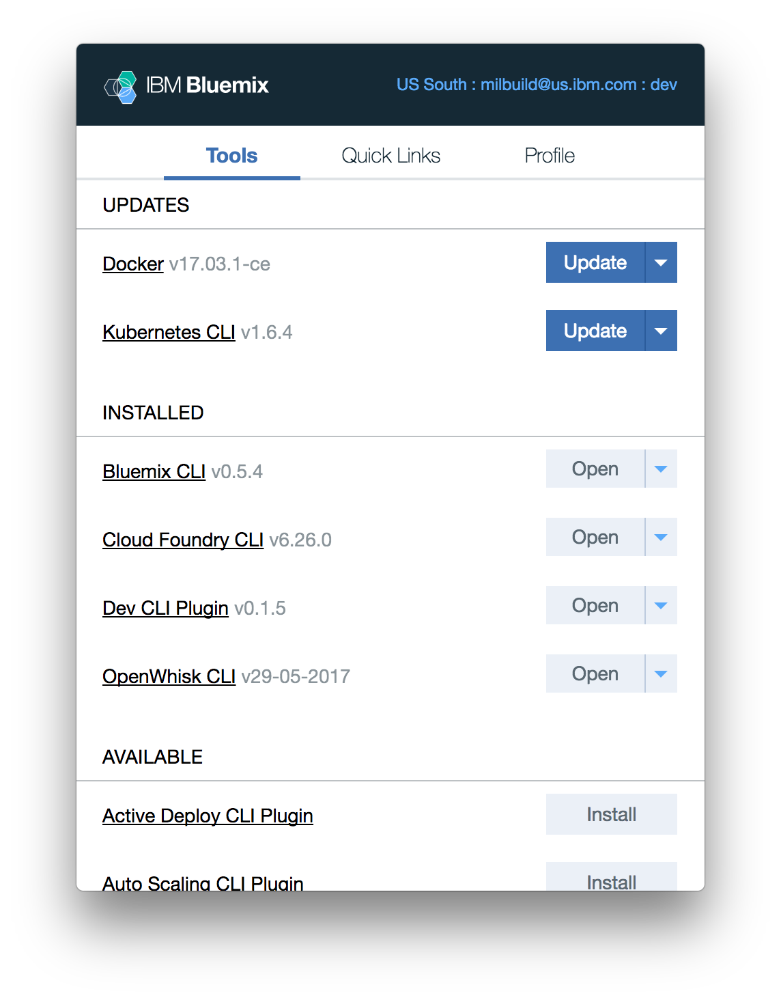

---

copyright:

  years: 2017

lastupdated: "2017-06-19"

---

{:shortdesc: .shortdesc}
{:codeblock: .codeblock}
{:screen: .screen}
{:new_window: target="_blank"}

# IBM Cloud Application Tools 2 (ベータ)
{: #icat}

IBM Cloud Application Tools 2 は、macOS でのローカル環境のセットアップと管理を目的として合理化されたメニュー・バー・アプリケーションです。IBM Cloud Application Tools 2 を使用することにより、{{site.data.keyword.Bluemix_notm}} のツールおよび CLI を容易にインストールおよび更新し、CLI のデプロイメント・ターゲットを変更し、共通の {{site.data.keyword.Bluemix_notm}} リンクに素早くアクセスすることができます。
{:shortdesc}

このツールを稼働させるには、[IBM Cloud Application Tools 2 Beta for macOS  をダウンロード](http://ibm.biz/icat-2-download){: new_window}します。 

[フィードバックをお寄せください](http://ibm.biz/icat-2-feedback){: new_window}

## フィーチャーおよび設定

### ツール

**「ツール」**タブから、{{site.data.keyword.Bluemix_notm}} CLI およびコマンド・ライン・インターフェース・プラグインをインストール、アクセス、および更新できます。 

   図 1. CLI およびプラグインを管理するための**「ツール」**タブ

### クイック・リンク

**「クイック・リンク」**タブから、{{site.data.keyword.Bluemix_notm}} カタログおよびダッシュボード、システム状況とアカウント管理の設定、および製品資料とサポートの各リンクにアクセスできます。 

   図 2. コンソール、製品資料、およびサポートにアクセスするための**「クイック・リンク」**タブ

### プロファイル

**「プロファイル」**タブから、ユーザー・アカウント設定およびデプロイメント・ターゲットを管理することができます。例えば、異なる地域、組織、またはスペースを指定することにより、インストールされているすべての CLI およびプラグインの `bx target` を変更できます。さらに、このタブからフィードバックを提供するためのオプションもあります。 

   図 3. ユーザー・アカウント設定および CLI のデプロイメント・ターゲットを管理するための**「プロファイル」**タブ

