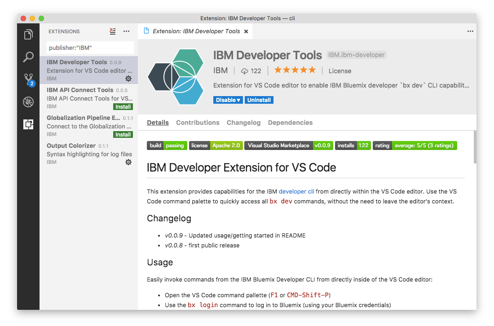

---

copyright:
  years: 2017, 2019
lastupdated: "2019-04-04"

keywords: cli, ibm cloud developer tools, visual studio code, install developer tools, developer extension, vscode cli, vscode plugin, cloud foundry vscode

subcollection: cloud-cli

---

{:shortdesc: .shortdesc}
{:codeblock: .codeblock}
{:screen: .screen}
{:new_window: target="_blank"}

# Visual Studio Code 用 IBM Cloud Developer Tools
{: #ibm-dev-tools-for-vscode}

IBM Cloud Developer Tools の Visual Studio Code 用拡張機能を使用すると、Visual Studio Code エディターのコマンド・パレット内から直接 IBM Developer CLI の機能にアクセスすることができます。 アプリのデプロイメント、{{site.data.keyword.cloud}} 上でのアプリの開始/停止/再始動、リモート・アプリ・ログの表示など、Docker と Cloud Foundry の両方のワークフローで、エディターのコンテキストを一切離れることなく、`ibmcloud dev` コマンドのサブセットに素早くアクセスすることができます。
{:shortdesc}

## 従属関係
{: #vscode-dependencies}

IBM Cloud Developer Tools の Visual Studio Code 用拡張機能を使用するには、[{{site.data.keyword.cloud_notm}} CLI](/docs/cli?topic=cloud-cli-ibmcloud-cli#ibmcloud-cli) および {{site.data.keyword.cloud_notm}} CLI プラグインがシステムにインストールされている必要があります。

## インストール
{: #vscode-installation}

{{site.data.keyword.dev_cli_notm}} のこの拡張機能をインストールするための最も簡単な方法は、以下に示すように、Visual Studio Code の「quick open」コマンドを使用することです。

1. エディター内から以下のキーの組み合わせを使用して、「quick open」コマンド・パレットを開きます。

  * **Mac:** `cmd + p`
  * **Windows / Linux:** `ctrl + p`

2. `ext install ibm-developer` コマンドを入力し、Enter キーを押してこの {{site.data.keyword.dev_cli_notm}} 拡張機能を Visual Studio Code エディター内にインストールします。

あるいは、以下に示すように、「拡張機能」管理ウィンドウを介してこの {{site.data.keyword.dev_cli_notm}} 拡張機能をインストールすることもできます。

1. Visual Studio Code エディターの**「拡張機能」**サイドバーを開き、次に、ストリング `publisher:IBM Developer` を使用して検索します。 {{site.data.keyword.dev_cli_notm}} 拡張機能が検索結果に表示されます。  
2. **「インストール」**をクリックしてインストールを開始します。

また、[Visual Studio Code Marketplace 内から直接、IBM Cloud Developer Tools 拡張機能](https://marketplace.visualstudio.com/items?itemName=IBM.ibm-developer){: new_window}  にアクセスすることもできます。

## 使用法
{: #vscode-usage}

Visual Studio Code のコマンド・パレットを使用して、拡張コマンドを開始します。

最初に、以下のキーの組み合わせを使用してコマンド・パレットを開きます。

* **Mac:** `cmd + shift + p`
* **Windows / Linux:** `ctrl + shift + p`

次に、開始するコマンドを入力または選択します。 コマンド・パレット内に「ibmcloud」と入力すると、すべての使用可能コマンドのリストを表示できます。

### Docker ワークフロー (Docker コンテナー) での IBM Developer Extension の使用
{: #usage-docker}

以下に示すように、ほんの数ステップで `ibmcloud dev` ワークフローを開始することができます。
* 以下の 2 つの方法のいずれかを使用してプロジェクトを作成します。
  * [{{site.data.keyword.cloud_notm}} Web コンソール](https://{DomainName}/developer/appservice/starter-kits){: new_window}  を使用し、生成されたコードをダウンロードします。
  * {{site.data.keyword.cloud_notm}} Developer Tools CLI Plug-in を使用し、[ibmcloud dev create](/docs/cli/idt?topic=cloud-cli-idt-cli#create) コマンドでプロジェクトを生成します。
* プロジェクトのフォルダーを Visual Studio Code エディターでローカルに開きます
* `ibmcloud dev build` コマンドを使用して、アプリをビルドして Docker イメージを作成します
* `ibmcloud dev debug` コマンドを使用して、開発用のローカル Docker でアプリを実行します
> 注: ローカル Docker コンテナー内で実行されている Node.js アプリケーションをデバッグするには、[ローカル・コンテナー用のデバッグ構成を追加](https://github.com/IBM-Cloud/ibm-developer-extension-vscode#debugging-nodejs-apps-within-the-local-docker-container){: new_window}  する必要があります。
* `ibmcloud dev run` コマンドを使用して、アプリをローカル Docker 内でリリース・モードで実行します
* `ibmcloud dev deploy` コマンドを使用して、アプリケーションを {{site.data.keyword.cloud_notm}} 上の Cloud Foundry ランタイムにデプロイします

### Cloud Foundry ワークフローでの IBM Developer Extension の使用
{: #usage-cloud-foundry}

現在、{{site.data.keyword.cloud_notm}} 上の Cloud Foundry ランタイムにアプリをデプロイしているユーザー用に、`cf` 操作セットのサポートもあります。

以下のに示すように、ほんの数ステップで Cloud Foundry ワークフローを開始することができます。
* 新規 Cloud Foundry アプリケーションを作成します。
  * [{{site.data.keyword.cloud_notm}} Web コンソール](https://{DomainName}/developer/appservice/starter-kits){: new_window}  を使用し、スターター・コードをダウンロードします。
  * 新しい Cloud Foundry アプリケーションを手動で作成します
* Visual Studio Code エディターでローカル環境でプロジェクト・フォルダーを開きます
* `ibmcloud cf apps` を使用して、すべてのアプリケーションをリストします
* `ibmcloud cf push` を使用して、アプリケーションのビルドを Cloud Foundry ランタイムにプッシュします
* `ibmcloud cf <start/stop/restage/restart>` を使用して、アプリケーションの状況を変更します
* `ibmcloud cf logs` を使用して、アプリケーションの稼働中のログ・ストリームを表示します
  * `ibmcloud cf logs` を使用してログ・ストリームを停止します
