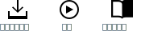

---

copyright:

  years: 2015, 2018

lastupdated: "2018-03-16"

---

{:shortdesc: .shortdesc}
{:codeblock: .codeblock}
{:screen: .screen}
{:tip: .tip}
{:new_window: target="_blank"}

# CLI およびツールの概要
{: #overview}

{{site.data.keyword.Bluemix_notm}} には、堅固な CLI、および CLI と統合されるプラグインと開発者ツール拡張機能が用意されています。

## {{site.data.keyword.Bluemix_notm}} CLI
{: #cli}

{{site.data.keyword.Bluemix}} CLI は、{{site.data.keyword.Bluemix_notm}} 環境内のリソースを管理するためのコマンド・ライン・エクスペリエンスを提供します。 また、Cloud Foundry アプリケーションとサービスを管理するための Cloud Foundry コマンド・ライン・インターフェースである cf が、そのインストール済み環境に組み込まれています。
{:shortdesc}

開始するには、以下のいずれかのオプションをクリックします。

<map name="home_map" id="home_map">
<area href="/docs/cli/reference/bluemix_cli/all_versions.html" alt="{{site.data.keyword.Bluemix_notm}} CLI のダウンロード (新規ページを開く)" title="ダウンロード" shape="rect" coords="-7, -8, 108, 211" />
<area href="/docs/cli/reference/bluemix_cli/get_started.html" alt="開始 (新規ページを開く)" title="開始" shape="rect" coords="155, -1, 289, 210" />
<area href="/docs/cli/reference/bluemix_cli/bx_cli.html" alt="資料の表示 (新規ページを開く)" title="資料の表示" shape="rect" coords="326, -10, 448, 218" />
</map>

## {{site.data.keyword.dev_cli_notm}}
{: #idt}

{{site.data.keyword.dev_cli_long}} (IDT) は、クラウド・ネイティブ・アプリを作成、ビルド、およびデプロイするための、{{site.data.keyword.Bluemix}} CLI に対する開発者固有の拡張機能 (`bx dev`) を提供します。 IDT のインストールには、基本の {{site.data.keyword.Bluemix_notm}} CLI、複数の拡張機能、およびすべてのシステムの前提条件が含まれます。IDT には、CLI コマンドに直接アクセスするための、複数の IDE 用拡張機能も用意されています。{:shortdesc}

- [概要とインストール](/docs/cli/idt/index.html)
- [開始](/docs/cli/idt/index.html)
- [コマンド](/docs/cli/idt/commands.html)
- [クラウド・ネイティブの開発](/docs/cli/index.html)
