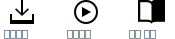

---

copyright:

  years: 2015, 2018

lastupdated: "2018-03-16"

---

{:shortdesc: .shortdesc}
{:codeblock: .codeblock}
{:screen: .screen}
{:tip: .tip}
{:new_window: target="_blank"}

# CLI 및 도구 개요
{: #overview}

{{site.data.keyword.Bluemix_notm}}는 강력한 CLI 및 CLI와 통합되는 개발자 도구 확장과 플러그인을 제공합니다.

## {{site.data.keyword.Bluemix_notm}} CLI
{: #cli}

{{site.data.keyword.Bluemix}} CLI는 명령행 경험을 제공하여 {{site.data.keyword.Bluemix_notm}} 환경에서 리소스를 관리합니다. Cloud Foundry 애플리케이션 및 서비스 관리를 위한 Cloud Foundry 명령행 인터페이스, cf도 포함합니다.
{:shortdesc}

시작하려면 옵션을 클릭하십시오.

<map name="home_map" id="home_map">
<area href="/docs/cli/reference/bluemix_cli/all_versions.html" alt="{{site.data.keyword.Bluemix_notm}} CLI 다운로드(새 페이지에서 열림)" title="다운로드" shape="rect" coords="-7, -8, 108, 211" />
<area href="/docs/cli/reference/bluemix_cli/get_started.html" alt="시작하기(새 페이지에서 열림)" title="시작하기" shape="rect" coords="155, -1, 289, 210" />
<area href="/docs/cli/reference/bluemix_cli/bx_cli.html" alt="문서 보기(새 페이지에서 열림)" title="문서 보기" shape="rect" coords="326, -10, 448, 218" />
</map>

## {{site.data.keyword.dev_cli_notm}}
{: #idt}

{{site.data.keyword.dev_cli_long}}(IDT)는 개발자 특정 확장을 {{site.data.keyword.Bluemix}} CLI(`bx dev`)에 제공하여 클라우드 원시 앱을 작성, 빌드 및 배치합니다. IDT 설치에는 기본 {{site.data.keyword.Bluemix_notm}} CLI, 여러 확장 및 모든 시스템 전제조건이 포함됩니다. IDT는 또한 CLI 명령에 직접 액세스하도록 여러 IDE에 확장을 제공합니다.
{:shortdesc}

- [개요 및 설치](/docs/cli/idt/index.html)
- [시작하기](/docs/cli/idt/index.html)
- [명령](/docs/cli/idt/commands.html)
- [Cloud 원시 개발](/docs/cli/index.html)
