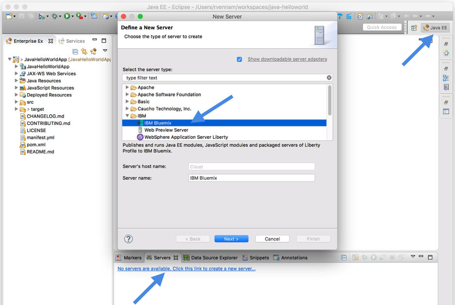

---

copyright:

  years: 2015，2017

lastupdated: "2018-06-21"

---

{:download: .download}
{:new_window: target="_blank"}
{:shortdesc: .shortdesc}

# Desenvolvendo usando o Eclipse Tools

O {{site.data.keyword.eclipsetoolsfull}} fornece ferramentas leves no Eclipse para desenvolvimento e integração rápidos de aplicativos com o {{site.data.keyword.Bluemix}} ou Cloud Foundry Clouds.
{:shortdesc}

  1. Se você ainda não tiver o Eclipse, instale o Eclipse Neon for Java EE Developers (4.6.1).

  2. Clique e mantenha pressionado o botão a seguir para arrastá-lo e soltá-lo na barra de ferramentas do Eclipse e, em seguida, siga os prompts para instalar o IBM Eclipse Tools for {{site.data.keyword.Bluemix_notm}}:

  

  3. Confirme se você está na perspectiva do Java Platform, Enterprise Edition e crie um servidor
do {{site.data.keyword.Bluemix_notm}} na guia Servidores.

  

  4. Implemente o seu aplicativo para o {{site.data.keyword.Bluemix_notm}} clicando com o botão direito no
servidor do {{site.data.keyword.Bluemix_notm}} e selecionando **Incluir e remover**.

Para obter instruções passo a passo na implementação de apps, veja [Implementando apps com o IBM Eclipse Tools for {{site.data.keyword.Bluemix_notm}} ](/docs/manageapps/eclipsetools/eclipsetools.html#eclipsetools){: new_window}.
