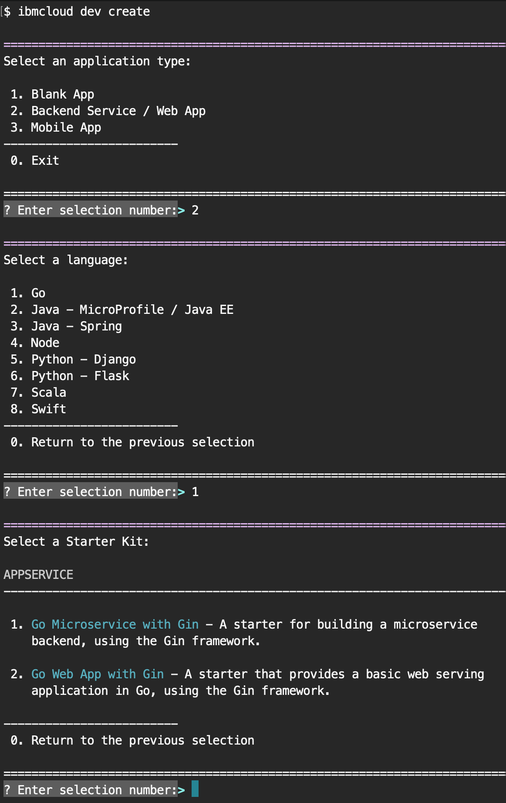

---
copyright:

  years: 2018

lastupdated: "2018-05-23"

---

{:new_window: target="_blank"}  
{:shortdesc: .shortdesc}  
{:screen: .screen}  
{:codeblock: .codeblock}  
{:pre: .pre}
{:tip: .tip}

# Usando o {{site.data.keyword.dev_cli_notm}} CLI
{: #developing}

O desenvolvendo de apps nativos do Cloud usando a CLI do {{site.data.keyword.dev_cli_notm}} segue
um fluxo bastante simples:

1. [Criar ou ativar um app](#create)
2. [Codificar, construir e executar](#build) seu app localmente usando contêineres
3. [Implementar](#deploy) seu app no {{site.data.keyword.Bluemix_notm}}

## Criar ou ativar um app
{: #create}

Há várias maneiras para criar um app Cloud.
- [Console da web de serviços de aplicativo](https://console.bluemix.net/developer/appservice) para apps genéricos da web e microsserviços
- [Painel do Watson](https://console.bluemix.net/dashboard/watson) para criar apps do iniciador ativado para recursos com base no Watson.
    - Outros painéis baseados no segmento de mercado ou na tecnologia estão disponíveis no menu
"Hamburger" na página inicial do {{site.data.keyword.Bluemix_notm}}. Todos têm uma abordagem semelhante de usar Kits do iniciador para criar novos apps.
- Comando [`ibmcloud dev create`](./commands.html#create) das CLIs do {{site.data.keyword.dev_cli_notm}} para criar um novo app.
- Comando [`ibmcloud dev enable`](./commands.html#enable) das CLIs do {{site.data.keyword.dev_cli_notm}} para ativar rapidamente a nuvem em um app existente do lado do servidor.

Para qualquer um dos métodos de criação anteriores, o fluxo é semelhante. É possível escolher o tipo de projeto, a linguagem de implementação e o padrão de app a serem usados. Também é possível optar por incluir serviços com um valor agregado em seu app, como autenticação ou
persistência. Finalmente, é possível escolher ativar o recurso do DevOps para o app que fornece uma cadeia de
ferramentas completa de controle de versão e de comunicações de equipe, bem como um pipeline que é acionado em
cada confirmação para validar, construir e implementar seu app no IBM Cloud.

   Figura 2. Fluxo de criação de amostra usando a CLI do IDT

A CLI do {{site.data.keyword.dev_cli_notm}} trabalha estreitamente junto para fornecer uma experiência contínua durante o desenvolvimento. Os projetos que são criados em qualquer um dos consoles da web fornecem um botão "Fazer download do código" para
fazer download do código-fonte gerado para sua estação para mais desenvolvimento.

### Comandos úteis da CLI
{: #helpful}

Os comandos da CLI a seguir ajudam a trabalhar com seu projeto e com os consoles da web:
- [`code`](./commands.html#code) para puxar diretamente um
código-fonte gerado por apps para a sua estação de trabalho
- [`console`](./commands.html#console) para abrir seu navegador para a página do projeto do app atual no {{site.data.keyword.Bluemix_notm}}
- Comando [`create`](./commands.html#create) para criar um novo app.
- [`delete`](./commands.html#delete) para excluir o app atual da área do projeto do {{site.data.keyword.Bluemix_notm}}.
- Comando [`enable`](./commands.html#enable) para ativação de nuvem em um app do lado do servidor existente.
- [`get-credenciais`](./commands.html#get-credentials) para obter
credenciais que são necessárias pelo projeto para ativar o uso de serviços de limite.
- [`list`](./commands.html#list) para listar todos os aplicativos que
você criou na organização/espaço atualmente selecionado, por meio da CLI ou dos consoles.

### Explorando a estrutura do projeto do app
{: #exploring-project}

Os projetos que são criados ou ativados para uso com a ferramenta são fornecidos com configurações
pré-definidas contidas no arquivo `cli-config.yml`. O `cli-config.yml`
contém entradas padrão que são usadas pelos comandos da ferramenta que podem ser substituídas por valores que
são transmitidos pela linha de comandos.

Mais detalhes sobre as estruturas do projeto podem ser localizados aqui:
- [Projetos Java](/docs/apps/projects/java_project_contents.html)
- [Projetos NodeJS](/docs/apps/projects/node_project_contents.html)
- [Projetos Python](/docs/apps/projects/python_project_contents.html)
- [Projetos Swift](/docs/apps/projects/swift_project_contents.html)

### Blogs e vídeos de referência
{: #ref1}

- Vídeo: [Instalando o IDT no Ubuntu Linux](https://www.youtube.com/watch?v=sr7KjHAKpEs)
- Blog: [Ativar projetos existentes para o IBM Cloud com o IBM Cloud Developer Tools CLI](https://www.ibm.com/blogs/bluemix/2017/09/enable-existing-projects-ibm-cloud-ibm-cloud-developer-tools-cli/)

## Codificar, construir e executar
{: #build}

Após seu projeto ter sido criado, agora depende de você criá-lo para algo útil. O fluxo geral consiste em editar o código-fonte e, em seguida, executar um [`ibmcloud dev build`](commands.html#build) para compilar o app em um contêiner local específico para a linguagem e a configuração do seu app. Dependendo da linguagem de apps e do gerador que é usado, há um ou mais contêineres padronizados para suportar
construção e execução localmente.  Geralmente, haverá um contêiner "ferramentas" para construções e depuração local.  Esse contêiner normalmente terá ferramentas e recursos extras para ajudá-lo no desenvolvimento.  Há também um contêiner de "execução" que simula aproximadamente o ambiente de tempo de execução real de seu app quando implementado na nuvem, no Cloud Foundry ou no ambiente de contêiner baseado em Kubernetes da IBM.

Você está livre para usar qualquer IDE ou editor que preferir para codificar seu aplicativo. Oferecemos uma extensão para o editor Microsoft VisualStudio Code (VSCode) que permite acessar todos os comandos do IDE diretamente no editor.

Depois que o projeto tiver sido construído, você desejará em seguida executar seu app usando o [`ibmcloud dev run`](commands.html#run) ou o [`ibmcloud dev debug`](commands.html#debug), dependendo da configuração do gerador de seus apps. Isso executará o app dentro do contêiner adequado.  Alguns padrões de apps suportam múltiplos contêineres externos para seus apps, como persistência ou outros recursos.  Eles serão iniciados automaticamente e configurados durante a execução ou depuração.  Há também um comando [`ibmcloud dev test`](commands.html#test) que executará quaisquer casos de teste associados ao app.

### Como os contêineres locais são usados
{: #local-containers}

A CLI do {{site.data.keyword.dev_cli_long}} usa dois contêineres para facilitar a construção
e o teste do aplicativo. O primeiro é o contêiner de ferramentas, que contém os utilitários necessários para construir e testar seu aplicativo. O Dockerfile para esse contêiner é definido pelo parâmetro [`dockerfile-tools`](commands.html#command-parameters). Você pode considerá-lo como um contêiner de desenvolvimento, pois contém as ferramentas normalmente usadas para o desenvolvimento de um tempo de execução específico.

O segundo contêiner é o contêiner de execução. Esse contêiner tem um formato adequado para ser implementado para uso, por exemplo, no {{site.data.keyword.Bluemix}}. Como resultado, um ponto de entrada que inicia seu aplicativo é definido. Ao selecionar para executar o aplicativo por meio da CLI do {{site.data.keyword.dev_cli_short}},
ele usa esse contêiner. O Dockerfile para esse contêiner é definido pelo parâmetro [`dockerfile-run`](commands.html#run-parameters).

### Comandos úteis da CLI
{: #helpful2}

Os comandos da CLI a seguir ajudam a trabalhar com seu projeto durante os ciclos de codificação, construção e execução:
- [`build`](./commands.html#build) Construa o projeto em um contêiner local
- [`debug`](./commands.html#debug) Depure seu aplicativo em um contêiner local
- [`run`](./commands.html#run) Execute seu aplicativo em um contêiner local
- [`shell`](./commands.html#shell) Abra um shell em um contêiner local
- [`status`](./commands.html#status) Verifique o status dos contêineres usados pela CLI
- [`stop`](./commands.html#stop) Pare um contêiner
- [`test`](./commands.html#test) Teste seu aplicativo em um contêiner local

### Blogs e vídeos de referência
{: #ref2}

- [Depurando apps locais](local_debug.html)

## Implementação
{: #deploy}

Em um ambiente nativo de nuvem adequado, você desejará utilizar um pipeline do DevOps totalmente funcional para gerenciar todas as implementações, bem como uma variedade de outros recursos.  Durante o fluxo de criação, é possível configurar seu app para usar o DevOps do IBM Cloud.  Se você não estiver pronto para usar o DevOps integrado, será possível executar manualmente [`ibmcloud dev deploy`](./commands.html#deploy) em seu app ou usar o comando deploy dentro de seu próprio pipeline do DevOps.  

### Comandos úteis da CLI
{: #helpful3}

Os comandos da CLI a seguir ajudam a trabalhar com seu projeto durante o processo de implementação:
- [`console`](./commands.html#console) Abre o console do IBM Cloud para um projeto
- [`deploy`](./commands.html#deploy) Implemente um aplicativo para o IBM Cloud
- [`view`](./commands.html#view) Visualize a URL de seu projeto

### Blogs e vídeos de referência
{: #ref3}

- Blog: [Implementando no IBM Cloud privado com o IBM Cloud Developer Tools CLI](https://www.ibm.com/blogs/bluemix/2017/09/deploying-ibm-cloud-private-ibm-cloud-developer-tools-cli/)
- Blog: [Implementando no Kubernetes no IBM Cloud com o IBM Cloud Developer Tools CLI](https://www.ibm.com/blogs/bluemix/2017/09/deploying-kubernetes-ibm-cloud-ibm-cloud-developer-tools-cli/)
