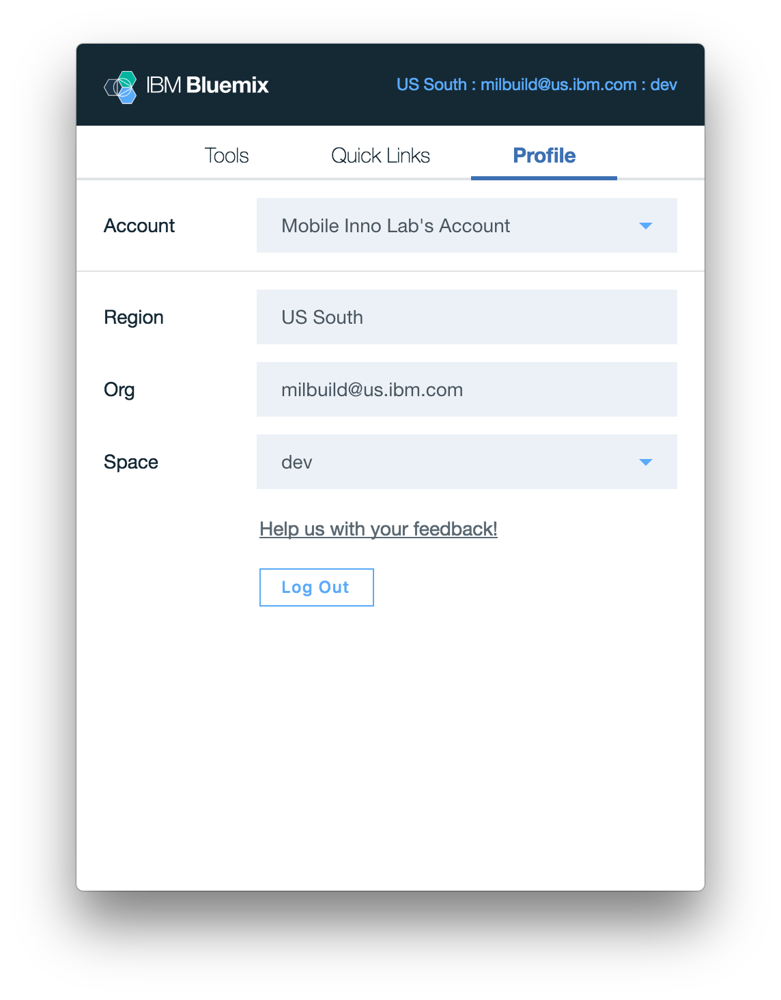

---

copyright:

  years: 2017

lastupdated: "2017-06-19"

---

{:shortdesc: .shortdesc}
{:codeblock: .codeblock}
{:screen: .screen}
{:new_window: target="_blank"}

# IBM Cloud Application Tools 2 (Beta)
{: #icat}

IBM Cloud Application Tools 2 是一个经过简化的菜单栏应用程序，用于在 macOS 上执行本地环境设置和管理。通过使用 IBM Cloud Application Tools 2，可以轻松安装和更新 {{site.data.keyword.Bluemix_notm}} 工具及 CLI，更改 CLI 部署目标，以及快速访问公共 {{site.data.keyword.Bluemix_notm}} 链接。
{:shortdesc}

要快速入门并熟悉运用，请[下载适用于 macOS 的 IBM Cloud Application Tools 2 Beta ](http://ibm.biz/icat-2-download){: new_window}。 

[需要提供反馈？](http://ibm.biz/icat-2-feedback){: new_window}

## 功能和设置

### 工具

在**工具**选项卡中，可以安装、访问和更新 {{site.data.keyword.Bluemix_notm}} CLI 和命令行界面插件。 

   图 1. 用于管理 CLI 和插件的**工具**选项卡

### 快速链接

在**快速链接**选项卡中，可以访问 {{site.data.keyword.Bluemix_notm}}“目录”和“仪表板”的链接，访问系统状态和帐户管理设置以及产品文档和支持。 

   图 2. 用于访问控制台、产品文档和支持的**快速链接**选项卡

### 概要文件

在**概要文件**选项卡中，可以管理用户帐户首选项和部署目标。例如，通过指定其他区域、组织或空间，可以针对安装的所有 CLI 和插件修改 `bx target`。此外，还有一个选项用于通过此选项卡提供反馈。 

   图 3. 用于管理用户帐户首选项和 CLI 部署目标的**概要文件**选项卡

