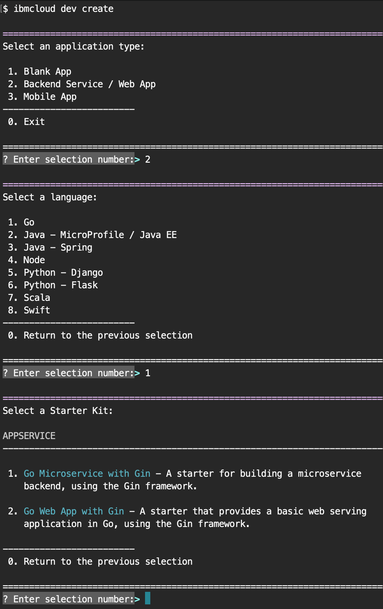

---

copyright:
  years: 2018, 2019
lastupdated: "2019-06-21"

keywords: cli, developing apps, deploying apps, create apps, ibmcloud dev enable, ibmcloud dev create, local containers, ibmcloud dev run, ibmcloud dev, cli blog, cli video, cli reference

subcollection: cloud-cli

---

{:new_window: target="_blank"}  
{:shortdesc: .shortdesc}  
{:screen: .screen}  
{:codeblock: .codeblock}
{:pre: .pre}
{:tip: .tip}

# 開發及部署應用程式
{: #developing}

使用 {{site.data.keyword.dev_cli_notm}} CLI 開發雲端原生應用程式時遵循相當簡單的流程：

1. [建立或啟用應用程式進行部署](#idt-create)。
2. 使用容器在本端[編寫程式碼、建置及執行](#code-build-run)應用程式。
3. 將應用程式[部署](#cli-deploy)至 {{site.data.keyword.cloud_notm}}。

## 建立或啟用應用程式進行雲端部署
{: #idt-create}

您有數種方式可以建立應用程式。
- 適用於通用 Web 應用程式及微服務的[應用程式服務 Web 主控台](https://cloud.ibm.com/developer/appservice/dashboard)
- 用於建立啟用 Watson 型功能之入門範本應用程式的 [Watson 儀表板](https://cloud.ibm.com/developer/watson/dashboard)。
    - 其他產業及技術型儀表板可以從 {{site.data.keyword.cloud_notm}} 首頁上的「漢堡式」功能表取得。全部都採用使用入門範本套件建立新應用程式的類似方法。
- {{site.data.keyword.dev_cli_notm}} CLI 的 [`ibmcloud dev create`](/docs/cli/idt?topic=cloud-cli-idt-cli#create) 指令以建立新的應用程式。
- {{site.data.keyword.dev_cli_notm}} CLI 的 [`ibmcloud dev enable`](/docs/cli/idt?topic=cloud-cli-idt-cli#enable) 指令以快速在現有伺服器端應用程式上啟用雲端。

針對上述任何建立方法，流程類似。選取要使用的專案類型、實作語言及應用程式模式。您也可以選擇將服務新增至應用程式（例如鑑別或持續性）。最後，您可以配置應用程式的持續交付，這會提供原始檔控制及團隊通訊的完整工具鏈。其中包括每次確定時觸發的管線，以驗證、建置應用程式，以及將您的應用程式部署至 {{site.data.keyword.cloud_notm}}。

{: caption="圖 1. 使用 {{site.data.keyword.dev_cli_notm}} CLI 的建立流程範例" caption-side="bottom"}

{{site.data.keyword.dev_cli_notm}} CLI 緊密合作，以在開發期間提供順暢經驗。從 Web 主控台中建立的專案都會提供**下載程式碼**按鈕，以將產生的原始碼下載至工作站，以進行進一步開發。

### 有用的 CLI 指令
{: #helpful}

下列 `ibmcloud dev` CLI 指令可協助您處理專案及 Web 主控台：
- [`code`](/docs/cli/idt?topic=cloud-cli-idt-cli#code)：用來將應用程式原始碼下載至工作站。
- [`console`](/docs/cli/idt?topic=cloud-cli-idt-cli#console)：將瀏覽器開啟到 {{site.data.keyword.cloud_notm}} 中現行應用程式的專案頁面。
- [`create`](/docs/cli/idt?topic=cloud-cli-idt-cli#create)：用來建立新應用程式的指令。
- [`delete`](/docs/cli/idt?topic=cloud-cli-idt-cli#delete)：用來從 {{site.data.keyword.cloud_notm}} 專案區域中刪除現行應用程式。
- [`enable`](/docs/cli/idt?topic=cloud-cli-idt-cli#enable)：用來對現有伺服器端應用程式啟用雲端功能的指令。
- [`get-credentials`](/docs/cli/idt?topic=cloud-cli-idt-cli#get-credentials)：用來取得專案所需的認證，以啟用連結服務。
- [`list`](/docs/cli/idt/?topic=cloud-cli-idt-cli#list)：用來從 CLI 或主控台，列出已在目前所選組織及空間中建立的所有應用程式。

### 探索應用程式的專案結構
{: #exploring-project}

已建立或啟用以與開發人員工具搭配使用的專案，會在 `cli-config.yml` 檔案中具有封裝的預先配置設定。`cli-config.yml` 具有 `ibmcloud dev` 指令所使用的預設項目，您可以將其置換為透過指令行所傳遞的值。

### 參照部落格及視訊
{: #ref1}

- 視訊：[在 Ubuntu Linux 上安裝 {{site.data.keyword.cloud_notm}} Developer Tools&trade;](https://www.youtube.com/watch?v=sr7KjHAKpEs){: new_window} 
- 部落格：[使用 {{site.data.keyword.dev_cli_short}} CLI 啟用 IBM Cloud 的現有專案](https://www.ibm.com/blogs/cloud-archive/2017/09/enable-existing-projects-ibm-cloud-ibm-cloud-developer-tools-cli//){: new_window} 

## 編寫程式碼、建置及執行
{: #code-build-run}

建立專案之後，您可以將它精心製作成有用的項目。一般流程包含編輯原始碼，然後執行 [`ibmcloud dev build`](/docs/cli/idt?topic=cloud-cli-idt-cli#build) 以在應用程式語言及配置特有的本端容器內編譯應用程式。根據使用的應用程式語言及產生器，有一個以上的容器預設為支援在本端進行建置及執行。一般而言，會有 "tools" 容器用於進行建置及本端除錯。此容器具有額外的工具及功能可協助您進行開發。還有一個 "run" 容器，可在部署至雲端（在 Cloud Foundry 或 IBM 的 Kubernetes 型容器環境中）時，模擬您應用程式的運行環境。

您可以免費使用偏好的 IDE 或編輯器來編寫應用程式。{{site.data.keyword.IBM_notm}} 提供 Microsoft&trade; Visual Studio Code (VSCode) 編輯器的延伸規格，讓您能夠直接在編輯器內存取所有 IDE 指令。

建置專案時，請使用 [`ibmcloud dev run`](/docs/cli/idt?topic=cloud-cli-idt-cli#run) 或 [`ibmcloud dev debug`](/docs/cli/idt?topic=cloud-cli-idt-cli#debug) 來執行您的應用程式。此應用程式會在適當的容器內執行。部分應用程式的型樣支援應用程式外部的多個容器。這些應用程式會在執行或除錯期間自動啟動及配置。還有 [`ibmcloud dev test`](/docs/cli/idt?topic=cloud-cli-idt-cli#test) 指令可執行與應用程式相關聯的任何測試案例。

### 本端容器的使用方式
{: #local-containers}

{{site.data.keyword.dev_cli_long}} CLI 使用兩個容器來建置及測試應用程式。第一個是 tools 容器，其中包含用來建置及測試應用程式的必要公用程式。此容器的 Dockerfile 是透過 [`dockerfile-tools`](/docs/cli/idt?topic=cloud-cli-idt-cli#command-parameters) 參數所定義。您可能會將它視為一個開發容器，因為它包含一般用於開發特定運行環境的工具。

第二個容器是 run 容器。此容器是適合部署以供使用的表單，例如，在 {{site.data.keyword.cloud}} 中。因此，定義了一個進入點以便啟動您的應用程式。當您選擇透過 {{site.data.keyword.dev_cli_short}} CLI 執行應用程式時，它會使用此容器。此容器的 Dockerfile 是透過 [`dockerfile-run`](/docs/cli/idt?topic=cloud-cli-idt-cli#run-parameters) 參數所定義。

### 有用的 CLI 指令
{: #helpful2}

下列 CLI 指令可協助您除錯專案：
- [`build`](/docs/cli/idt?topic=cloud-cli-idt-cli#build)：在本端容器中建置專案。
- [`debug`](/docs/cli/idt?topic=cloud-cli-idt-cli#debug)：在本端容器中針對您的應用程式進行除錯。
- [`run`](/docs/cli/idt?topic=cloud-cli-idt-cli#run)：在本端容器中執行應用程式。
- [`shell`](/docs/cli/idt?topic=cloud-cli-idt-cli#shell)：開啟 Shell 以連接至本端容器。
- [`status`](/docs/cli/idt?topic=cloud-cli-idt-cli#status)：檢查 {{site.data.keyword.dev_cli_notm}} CLI 所使用容器的狀態。
- [`stop`](/docs/cli/idt?topic=cloud-cli-idt-cli#stop)：停止容器
- [`test`](/docs/cli/idt?topic=cloud-cli-idt-cli#test)：在本端容器中測試應用程式。

### 對本端應用程式進行除錯
{: #ref2}

- [對本端應用程式進行除錯](/docs/cli/idt?topic=cloud-cli-local-debug#local-debug)

## 部署
{: #cli-deploy}

在適當的雲端原生環境下，您可以使用完整運作的 DevOps 管線來管理所有部署，以及其他許多功能。在建立流程期間，您可以設定應用程式以使用 IBM Cloud 的 DevOps。如果您還沒有準備好使用內建 DevOps，則可以手動執行 [`ibmcloud dev deploy`](/docs/cli/idt?topic=cloud-cli-idt-cli#deploy) 來部署應用程式，或在自己的 DevOps 管線內使用 `deploy` 指令。

### 有用的 CLI 指令
{: #helpful3}

下列 CLI 指令可協助您在部署過程中處理專案：
- [`console`](/docs/cli/idt?topic=cloud-cli-idt-cli#console)：開啟專案的 {{site.data.keyword.cloud_notm}} 主控台。
- [`deploy`](/docs/cli/idt?topic=cloud-cli-idt-cli#deploy)：將應用程式部署至 {{site.data.keyword.cloud_notm}}。
- [`view`](/docs/cli/idt?topic=cloud-cli-idt-cli#view)：檢視專案的 URL。

### 參照部落格及視訊
{: #ref3}

- 部落格：[Deploying to {{site.data.keyword.cloud_notm}} Private with {{site.data.keyword.cloud_notm}} Developer Tools CLI](https://www.ibm.com/cloud/blog/deploying-ibm-cloud-private-ibm-cloud-developer-tools-cli){: new_window} 
- 部落格：[Deploying to Kubernetes on {{site.data.keyword.cloud_notm}} with the {{site.data.keyword.cloud_notm}} Developer Tools CLI](https://www.ibm.com/blogs/cloud-archive/2017/09/deploying-kubernetes-ibm-cloud-ibm-cloud-developer-tools-cli/){: new_window} 
