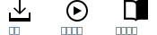

---

copyright:

  years: 2015, 2018

lastupdated: "2018-03-16"

---

{:shortdesc: .shortdesc}
{:codeblock: .codeblock}
{:screen: .screen}
{:tip: .tip}
{:new_window: target="_blank"}

# CLI 及工具概觀
{: #overview}

{{site.data.keyword.Bluemix_notm}} 提供一個健全的 CLI，以及與 CLI 整合的外掛程式和開發人員工具延伸規格。

## {{site.data.keyword.Bluemix_notm}} CLI
{: #cli}

{{site.data.keyword.Bluemix}} CLI 提供指令行體驗來管理 {{site.data.keyword.Bluemix_notm}} 環境中的資源。它也會在其安裝中包括 Cloud Foundry 指令行介面 cf，用來管理 Cloud Foundry 應用程式及服務。
{:shortdesc}

按一下選項以開始使用：

<map name="home_map" id="home_map">
<area href="/docs/cli/reference/bluemix_cli/all_versions.html" alt="下載 {{site.data.keyword.Bluemix_notm}} CLI（開啟新頁面）" title="下載" shape="rect" coords="-7, -8, 108, 211" />
<area href="/docs/cli/reference/bluemix_cli/get_started.html" alt="開始使用（開啟新頁面）" title="開始使用" shape="rect" coords="155, -1, 289, 210" />
<area href="/docs/cli/reference/bluemix_cli/bx_cli.html" alt="檢視文件（開啟新頁面）" title="檢視文件" shape="rect" coords="326, -10, 448, 218" />
</map>

## {{site.data.keyword.dev_cli_notm}}
{: #idt}

{{site.data.keyword.dev_cli_long}} (IDT) 提供 {{site.data.keyword.Bluemix}} CLI 的開發人員特定延伸規格 (`bx dev`)，以建立、建置及部署雲端原生應用程式。IDT 安裝包括基礎 {{site.data.keyword.Bluemix_notm}} CLI、數個延伸規格及所有系統必要條件。IDT 也提供多個 IDE 的延伸規格，來直接存取 CLI 指令。
{:shortdesc}

- [概觀及安裝](/docs/cli/idt/index.html)
- [開始使用](/docs/cli/idt/index.html)
- [指令](/docs/cli/idt/commands.html)
- [雲端原生開發](/docs/cli/index.html) ਍
